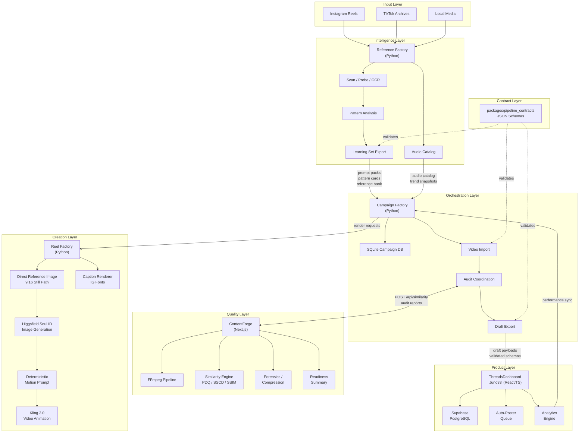
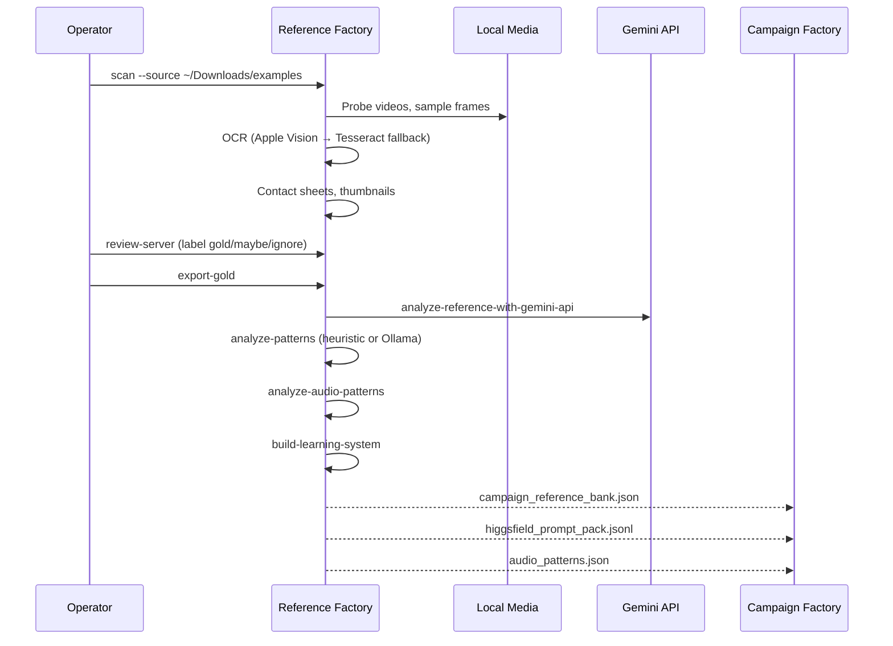
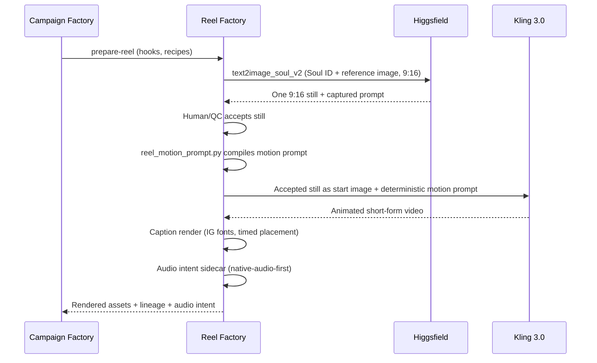
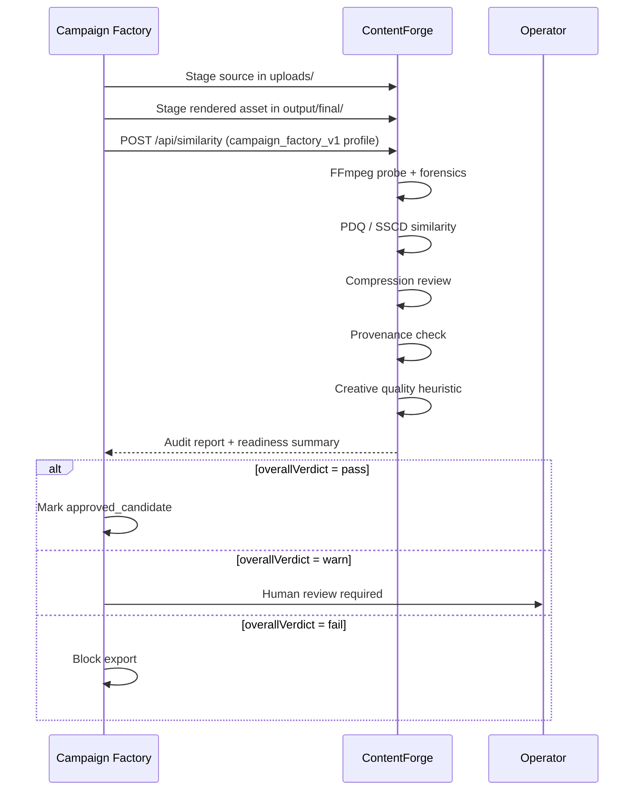
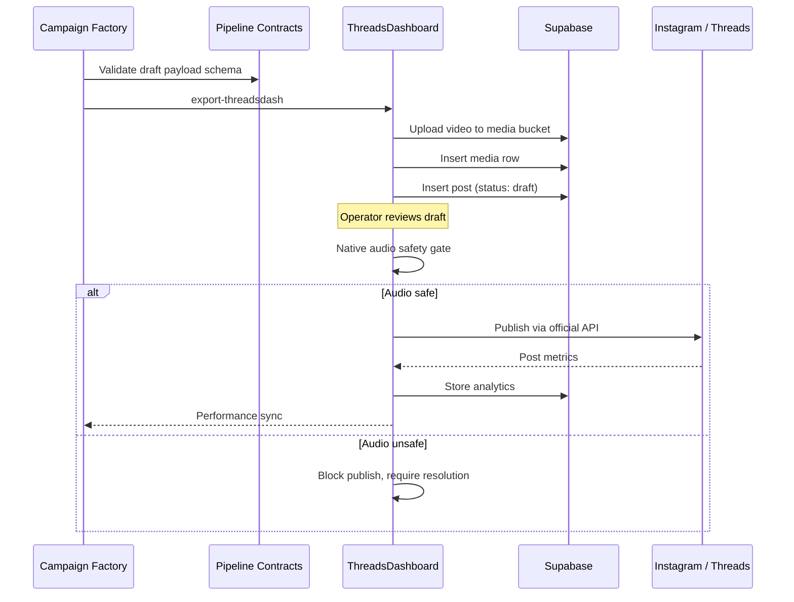

# Architecture

This document covers the detailed technical architecture of Creator OS.

---

## System Diagram

---

## Data Flow Detail

### Phase 1: Reference Intelligence

### Phase 2: Asset Creation

### Phase 3: Quality Audit

### Phase 4: Publishing

---

## Database Architecture

### ThreadsDashboard (Supabase / PostgreSQL)
The production database with 472 migrations managing:
- User accounts and team membership
- Connected social accounts (Threads, Instagram, Facebook)
- Posts, drafts, and media storage
- Analytics snapshots and aggregations
- Auto-poster queue and scheduling
- Competitor tracking snapshots
- Social listening alerts
- Stripe billing state
- Webhook event processing

### Campaign Factory (Local SQLite — 48 tables)
A local campaign database with 48 tables tracking:
- Campaign state and metadata
- Source assets and import lineage
- Rendered assets and variant families
- ContentForge audit results
- Account assignments and distribution plans
- Activity logs and durable job records
- Performance sync history
- Caption families and outcome tracking
- Content graph (nodes, edges, sync state)
- Recommendation runs, items, and accuracy
- Trust settings, exceptions, and quarantine
- Audio trend snapshots, selections, and performance rollups

---

## Security Model

### What Creator OS Does NOT Do
- ❌ Instagram/TikTok private API automation
- ❌ Login automation or cookie injection
- ❌ Unauthorized publishing bypass
- ❌ Burn copyrighted trending audio into files
- ❌ Auto-publish without operator approval

### What Creator OS Does
- ✅ Official Meta API integrations only
- ✅ Draft-first publishing with safety gates
- ✅ Native audio resolution (operator attaches in-app)
- ✅ Idempotency guards on all publish paths
- ✅ Kill-switch capability on auto-poster
- ✅ Secrets redacted from job/event metadata
- ✅ Row-Level Security (RLS) on all Supabase tables
