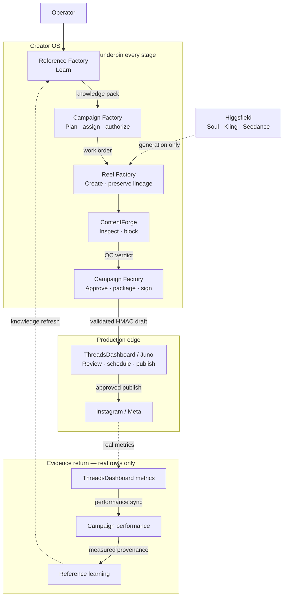

# Creator OS System Map

This is the durable source and runtime map. It describes ownership and
available evidence; it does not imply deployment or a successful live run.

## Four Truth Levels

1. **Implemented locally**: code exists in a checkout and local tests may pass.
2. **Merged to `main`**: GitHub `main` contains the exact commit and its required
   CI passed.
3. **Promoted to runtime**: the separate `creator-os-runtime` checkout was
   explicitly updated to a recorded Git SHA.
4. **Proven operationally**: a bounded real run produced receipts, state
   transitions, and downstream evidence.

Never collapse these into “working” or “deployed.” Source, runtime, machine
state, paid providers, and ThreadsDashboard production have separate evidence.

## Current Operational Truth

Operational truth is intentionally not hard-coded in this durable document.
Source, runtime, account, queue, provider, and metric state all drift. Establish
them from fresh evidence every time:

```bash
git fetch origin main
git rev-parse origin/main
/Users/aderdesouza/Developer/creator-os-runtime/scripts/creator-os \
  status --live-read-only --json
```

Record the resulting source SHA, runtime SHA, trace ID, check counts, and dated
receipts in a run-specific audit report under `~/.creator-os/analysis/`. A
passing source verifier never proves runtime promotion. A passing read-only
status never proves that a post published. A QStash receipt never proves an
Instagram identity or metric row.

The minimum operational closure for a run is:

1. Exact source and runtime SHAs are recorded separately.
2. Read-only status/config/database/HMAC/provider probes pass without product
   writes, provider jobs, or cost events.
3. Every production action has its own exact account, media, caption, mode, and
   downstream receipt reconciliation.
4. Learning remains off until genuine Instagram publication identity and
   metric-history observations exist; missing observations are never zero.

Historical backup, deployment, publication, experiment, and metric evidence
belongs in dated audit artifacts, not in this map. Trial capability and OAuth
scope counts likewise come only from a fresh ThreadsDashboard account
projection.

## Lifecycle Overview

The system has three distinct bands: create and validate, publish, and return
real evidence. Creator OS Core and Pipeline Contracts are foundations shared by
the Creator OS stages, not additional workflow steps.



The next section records implementation ownership and foundational
dependencies separately from this lifecycle view.

## Ownership And Dependencies

| Component | Responsibility | Canonical source | Depends on | Primary state |
|---|---|---|---|---|
| Reference Factory | intake, human labels, winner patterns, prompt packs, audio recommendations, outcome learning | `python_packages/reference_factory/reference_factory` | Pipeline Contracts and Creator OS Core | `REFERENCE_FACTORY_DB`, `REFERENCE_FACTORY_DATA_ROOT` |
| Reel Factory | Soul stills, free static MP4s, optional motion/Kling, placement/rendering, worker media lineage | `python_packages/reel_factory/reel_factory` | Pipeline Contracts, Creator OS Core, FFmpeg and optional local models/providers | local media, render queue/cache, derived media features, caption banks, lineage sidecars |
| Campaign Factory | creative plans, inventory, assignment, approvals, provider-spend authorization/ledger, readiness, QC requests, draft construction, performance ingestion | `python_packages/campaign_factory/campaign_factory` | stable Reel Factory worker API and commands, ContentForge CLI, Pipeline Contracts, Creator OS Core | `CAMPAIGN_FACTORY_DB`, campaign artifact directories |
| ContentForge | PDQ/SSCD collision checks, sibling distinctness, OCR/safe-zone/readability/watchability, media evidence and blocking verdict | `packages/contentforge` | Node, FFmpeg/FFprobe and optional local OCR/fingerprint tools | request-scoped ignored local output |
| Pipeline Contracts | canonical schemas and validators | `packages/pipeline_contracts/pipeline_contracts` | standard validation libraries only | schemas and generated TypeScript |
| Creator OS Core | only shared auth, atomic file operations, SQLite, vectors, media probes, runtime paths, and global runtime guard | `packages/creator_os_core/creator_os_core` | foundational only; never imports factories | no owned business state |
| ThreadsDashboard | product UI, accounts, Supabase, approvals, scheduling, publishing, inbox, analytics, posting infrastructure | external `/Users/aderdesouza/Developer/ThreadsDashboard` | its own services plus pinned `@creator-os/pipeline-contracts` release | Supabase and deployed services |

## Repository Map

```text
scripts/creator-os
  operator CLI; selects one explicit workflow and never schedules or publishes

packages/creator_os_core/creator_os_core
  runtime paths, auth, SQLite/file safety, media probes, shared infrastructure

packages/pipeline_contracts/pipeline_contracts/schemas
  only hand-edited cross-component schemas
packages/pipeline_contracts/typescript/generated-schemas.ts
  generated TypeScript schema bundle
packages/pipeline_contracts/typescript/index.ts
  validator and semantic helper surface backed by the generated bundle

python_packages/reference_factory/reference_factory
  intake, human review, patterns, knowledge packs, learning provenance
python_packages/reel_factory/reel_factory
  placement, captions, rendering, provider workers, local SQLite render queue
python_packages/campaign_factory/campaign_factory
  plans, assignment, spend authority, readiness, handoff, metric ingestion
python_packages/campaign_factory/repurposer
  optional zero-provider-cost variation worker reached only through Campaign's
  explicit variation stage; not a lifecycle stage or second control plane

packages/contentforge
  direct headless CLI for media inspection, distinctness, and blocking QC

tests/integration
  cross-component, runtime-path, handoff, and operator-command evidence
```

The repository intentionally has no second control plane. TypeScript validators
consume generated canonical schemas rather than maintaining hand-written schema
mirrors. Reel Factory has one local SQLite render queue. ContentForge runs a
bounded command directly; it has no HTTP server, daemon, background job API, or
polling queue.

## Local Motion Evidence, Arena, And Routing

Local Wan/LTX/LongCat execution remains a Reel Factory worker concern. The
evidence path deliberately reuses the existing machine-wide generation queue
and benchmark journals:

```text
Campaign content intent + execution policy
  -> BenchmarkRecipeV1 + exact AnalyzerRegistryV1 snapshot
  -> LocalModelArena immutable plan
  -> exact LocalGenerationQueue job (same ID and fingerprint as normal motion)
  -> local output + measured duration/memory + exact output SHA-256
  -> ContentForge trusted-media observations and per-analyzer receipts
  -> Reel Factory identity receipt + structured blinded human review
  -> ContentForge final motion-QC receipt
  -> measured BenchmarkReceipt
  -> matched promotion evaluation + explicit scoped approval
  -> Router v1 decision, or fail closed
```

`LocalModelArenaStore` adds only content-addressed plans and an append-only
outcome journal beside the existing benchmark evidence. It is not a queue,
workflow engine, or database. Failed, interrupted, resource-blocked,
unsupported, and missing samples stay in the frozen denominator. A successful
generation whose QC fails remains measured but contributes zero
promotion-eligible yield.

Promotion comparisons use one identical creator/identity/intent/source/prompt/
seed/duration/resolution grid across every competing model. The private plan is
never the reviewer surface because it contains model mappings. Reviewers see a
separately shuffled, model-free, authenticated review packet; all signed
blinded reviews are locked before a distinct authenticated unblinding receipt
reveals the sample/model mapping. Promotion summaries and Router decisions bind
both packet and unblinding fingerprints.

The generation journal also projects exact execution attempt count, retry count,
admission-block count, stable failure class, measured duration/peak memory when
available, and local-compute cost availability. Creator OS has no machine cost
meter, so local cost is recorded as unavailable with reason
`local_compute_cost_not_metered`, never as a fabricated zero-dollar result.

ContentForge's registry adapter snapshots each real analyzer ID, version,
evidence kinds, repository-relative implementation reference, and
implementation SHA-256. The current trusted automated producers cover media
integrity, temporal motion/freeze/continuity, audio integrity/A-V container
timing, and overlay delivery when applicable. Reel Factory adds the exact
identity and structured-human-review producers. Anatomy and conversion quality
remain human evidence. Speaking-video lip-sync is measured locally; it remains
promotion-ineligible whenever that analyzer cannot produce sufficient trusted
audio, speech, face-track, and correlation evidence.

The public ContentForge `motion-qc` surface accepts only canonical trusted-media
analysis, the exact AnalyzerRegistry snapshot, and a complete structured human
review. Raw analyzer values remain diagnostic-only and cannot produce a
Campaign-eligible receipt. The resulting
`contentforge.motion_specific_qc_receipt.v2` embeds and fingerprints all three
records. Campaign Factory independently revalidates their media/source links,
receipt and record fingerprints, analyzer identities, and current
implementation file hashes before storing an immutable registration. Legacy v1
receipts remain historical evidence but are not publishability evidence.

Trusted analysis operates on an immutable private snapshot, rejects symlinks
and non-regular media, and rehashes before signing. Temporal inspection covers
the full duration at 8 fps and 180x320, records the deterministic frame set and
brief-frame outliers, and scores discontinuity from robust outlier candidates
rather than ordinary high motion. Speaking-video evidence uses a local 12 fps
face/mouth tracker plus decoded PCM speech activity and audio-visual
correlation. Missing audio, speech, face coverage, or sufficient samples is a
blocked measurement, never an inferred pass.

Trusted analysis, structured human review, motion QC, creative approval, and
promotion evidence are authenticated with the local
`CREATOR_OS_EVIDENCE_AUTH_SECRET`. A missing or short secret fails closed;
fingerprints alone establish integrity, not producer authenticity.

Router v1 considers only ready local models with current manifests, exact
linked benchmark receipts, a non-expired/non-revoked explicit promotion,
applicable capability, sufficient measured quality/yield, fresh evidence, and
enough memory. It never silently selects a paid provider or the retired legacy
local-motion path. Promotion must bind the exact creator/identity/intent cohort,
candidate benchmark IDs, and current hardware fingerprint that Router scores.
An operator override may select only an otherwise valid candidate and is
explicitly excluded from benchmark learning.

Ordinary `creator-os create --mode local_wan` uses the same evidence gate. It
requires an exact thin-evidence bundle plus the frozen Arena plan/summary,
invokes Router before worker admission, and carries the full admission through
the queue job and asset lineage. `--motion-model` is an audited override, not a
direct bypass; it requires an operator and substantive reason and may select
only an otherwise eligible Router candidate. Immediately before execution,
Campaign rehashes the current still/audio and revalidates the exact task,
recipe, registry, Arena, Router, and active-promotion evidence so a stale
admission cannot authorize substituted inputs or a revoked model.

Installed model files alone do not establish routing readiness. Until deep
content verification, real provider-free queue jobs, output-bound QC, blinded
reviews, benchmark receipts, and explicit promotion records exist, the Router
must return no eligible model.

Promotion-eligible local workers run under a macOS no-network sandbox with a
minimal environment and writes restricted to the exact artifact root. They do
not inherit provider, Supabase, deployment, publishing, `PYTHONPATH`, or DYLD
credentials. Output is streamed to a bounded append-only log and recorded by
path/SHA/tail. Deep model verification is cached only as a content-addressed
attestation bound to manifest, file metadata, runtime source, and environment;
drift invalidates it and the selected model is checked again at execution.

Campaign pipeline jobs use expected-state compare-and-swap transitions. Only a
queued job can start, only its running owner can finish/fail it, terminal rows
cannot be rewritten, and reclaim reports success only when its conditional
update wins. Generated output bytes live in one content-addressed blob record;
every generation invocation still creates its own append-only attempt and
lineage edge, so identical bytes never erase model/prompt/input/admission
history. Local admission, recipe, and analyzer documents cross the Campaign ->
Reel boundary as read-only content-addressed files with expected SHA-256 values,
not process-list-visible JSON arguments.

## Ordinary Operator Surface And Runtime Promotion

The ordinary command surface is intentionally small:

```text
creator-os status
creator-os create --mode ...
creator-os review ...
creator-os approve ...
creator-os export ...
creator-os promote ...
```

Model installation, queue recovery, benchmark inspection, Arena diagnostics,
Router diagnostics, and analyzer snapshots live under `creator-os advanced`.
The former top-level diagnostic commands remain compatibility aliases with
deprecation notices.

One `campaign_factory.creative_approval.v2` record binds the exact creator,
source, output, intent, recipe, model, QC receipt set, and export-payload
projection. Campaign readiness and export both reload and revalidate that exact
record; historical v1 approvals cannot authorize export. It also keeps burned
overlay text, Instagram post caption,
generated audio, source audio, and native Instagram audio as separate fields.
The ordinary `creator-os approve` path generates its own content-addressed
dry-run review manifest, snapshots the already-registered canonical motion-QC
receipt, signs the resulting approval with the evidence-attestation secret, and
persists it without provider or production writes. Local approvals require the
exact Router admission; paid approvals instead require mutually exclusive
WaveSpeed request, authorization, prediction, spend, input, output, and provider
evidence captured at generation time. `creator-os approve-import` is retained
only as a compatibility path for an already-signed approval.

`creator-os promote` is local source/runtime management, not production
publishing. It requires an exact clean reviewed commit, a write-capable
non-author approval, and live GitHub verification of trusted workflow/app
identities. A deterministic runtime-scoped lock prevents alternate state roots
from racing one checkout. Promotion accepts only an initially detached runtime,
revalidates mutable authority under the lock, creates and verifies a Git bundle
plus backup manifest, and runs verification under a credential-scrubbed
environment. Health policy `creator_os.runtime_live_read_only_health.v1`
requires its exact nine-check inventory, all `PASS`. Authenticated journals and
receipts are fail-closed; recovery verifies the bundle and can re-import the
prior commit before rollback. It never mutates operational databases,
ThreadsDashboard, providers, schedules, or posts.

## Failure And Authority Map

| Failure | Owner that detects it | Required outcome |
|---|---|---|
| missing, substituted, or hash-mismatched source media | Reel/Campaign lineage checks | fail closed before QC or upload |
| unsafe or unreadable overlay, incomplete timed payoff, no safe lane | Reel placement/semantic proof and ContentForge | reject the derivative or ship clean media with post-caption text |
| duplicate or weakly distinct derivative | ContentForge plus Campaign readiness | block that derivative; never rewrite provenance |
| invalid asset state, missing approval, or contract drift | Campaign Factory | no upload and no draft ingest |
| stale account/OAuth/Trial capability | ThreadsDashboard projection consumed by Campaign | require a fresh projection; denied is never retried implicitly |
| queue delivery or publish failure | ThreadsDashboard | preserve exact attempt state; never treat dispatch as publication |
| missing Instagram identity or metric-history observation | ThreadsDashboard metrics and Campaign ingestion | exclude from learning; missing is not zero |
| provider, budget, or authorization failure | Campaign spend authority and Reel worker | create no paid job without a signed one-time authorization |

## Practical Value Of Each Component

| Component | Operational value | What becomes worse without it |
|---|---|---|
| Campaign Factory | **Essential control plane.** It turns goals, account policy, inventory, approvals, spend limits, and measured outcomes into one auditable decision. | Decisions fragment across scripts; cost, eligibility, and learning can disagree. |
| ThreadsDashboard | **Essential production edge.** It owns the real accounts and the only approved path to review, schedule, publish, and measure posts. | Creator OS can make assets but cannot safely operate Instagram accounts. |
| Reel Factory | **Essential media worker.** It converts accepted references or library assets into 9:16 still/static/motion Reels with exact lineage. | There is no repeatable asset-generation/rendering pipeline or reliable static fallback. |
| ContentForge | **High-value quality firewall.** It blocks collisions, unreadable overlays, unsafe placement, weak watchability, and broken media. | More visibly bad or duplicate-looking assets reach review and waste operator time. |
| Reference Factory | **High-value scaling memory.** It preserves human Gold labels and reusable prompt, visual, caption, and audio patterns. | The system can still make one Reel, but it relearns taste repeatedly and scales poorly. |
| Pipeline Contracts | **Essential connective tissue.** They make every handoff explicit and reject malformed or drifted payloads. | Components appear connected until a field or schema changes and silently breaks a seam. |
| Creator OS Core | **High-value reliability layer.** It centralizes private roots, SQLite safety, auth, file operations, spend primitives, and runtime guards. | Each factory reimplements fragile infrastructure and runtime paths drift back into checkouts. |

The useful simplification is therefore not to merge these packages. It is to
keep one operational brain, narrow workers, one production publisher, and
strict contracts between them.

Dependency direction is inward toward Pipeline Contracts and Creator OS Core.
Reel and Reference do not import Campaign ownership. Campaign may invoke
package-owned Reel/ContentForge commands but remains the only campaign brain.
The only in-process Reel dependency allowed from Campaign is the narrow
`reel_factory.worker_api` facade for pure caption-bank and remix-plan helpers;
generation and rendering continue through worker commands and lineage
contracts. Repository architecture checks reject imports of other Reel Factory
internals from Campaign.

`repurposer` is not a factory or lifecycle stage. It is an isolated optional
zero-cost variation utility packaged beside Campaign Factory and reached only
through the explicit variation stage. It does not own campaign state,
generation, providers, scheduling, or publishing, and it must not import Reel
Factory generation internals.

## Active End-To-End Flow

```text
reference intake
  -> Reference Factory local analysis and operator labels
  -> reference_factory.knowledge_pack.v1 (Gold references, prompt/pattern cards,
     caption/audio patterns, measured provenance)
  -> Campaign Factory creative plan and account assignment
  -> Campaign-issued, signed one-time spend authorization for paid modes
  -> Reel Factory direct Higgsfield Soul still + lineage
  -> mandatory local static MP4 for accepted stills
  -> optional pinned local Wan/LTX/LongCat MLX or approved WaveSpeed motion
  -> machine-wide local generation lease + unified-memory admission
  -> exact BenchmarkRecipeV1 + AnalyzerRegistryV1 fingerprints on benchmark jobs
  -> motion-specific temporal/identity/anatomy/audio/lip-sync evidence gate
  -> placement.py -> caption_render.py when an overlay has a safe lane
  -> ContentForge headless JSON QC and distinctness verdict
  -> Campaign Factory readiness and pipeline-contract validation
  -> HMAC-signed draft-only ingest request
  -> ThreadsDashboard approval, native-audio proof, scheduling, publishing
  -> post metric history
  -> performance sync
  -> Campaign performance_snapshots
  -> Reference measured provenance and versioned knowledge-pack refresh
  -> explicit advisory knowledge projection back into Campaign decisions
```

ThreadsDashboard is the only scheduling and publishing owner. Creator OS stops
at validated draft handoff.

## Creative Modes

- `library_reuse`: import an explicit media folder for an explicit model without
  provider generation. Folder and model are required; there is no proactive
  recommendation alias. ContentForge failures remain review-only but are
  reported honestly as `validated_with_failures`, never `validated`.
- `soul_static`: direct Soul still plus local static MP4.
- `local_wan`: the stable compatibility id for local Apple-silicon MLX motion.
  Model choice is explicit: Wan 2.2 TI2V-5B q8 for volume, Wan 2.2 I2V-A14B q4
  for quality, quantized LTX-2.3 Q4 for fast generated-audio motion, or
  quantized LTX-2.3 Q8 for HQ source/generated audio, first/last frames,
  keyframes, retake, and extension. LTX runs in its own pinned native MLX
  runtime with low-RAM streaming; every source image, audio track, end frame,
  and edited source video remains fingerprinted. Experimental LongCat Avatar
  1.5 q4 adds local image-plus-speech talking video behind lip-sync and memory
  canary gates. The static fallback is always retained. Installation is a
  separate pinned setup action; generation is offline and cannot download
  weights. Local jobs use one machine-wide resource lease and append-only
  recovery journal. Model promotion requires matched measured benchmarks and
  manual approval. New measured benchmark receipts copy the exact canonical
  recipe and ContentForge analyzer-registry snapshots into content-addressed
  local evidence, bind both fingerprints to the originating queue job and
  output, and re-verify analyzer implementation hashes plus output-bound QC at
  evaluation and approval time. Historical unlinked receipts remain readable
  but are never assigned inferred evidence or promoted.
- `best_motion`: explicitly selected WaveSpeed motion. Wan 2.7 Pro is the
  quality default, standard Wan 2.7 is the economy control, Wan 2.7 Reference
  handles multi-reference motion, and Wan 2.2 S2V handles speaking video.
- `reference_video_remix`: reference motion analysis plus new Soul endpoints,
  followed by an explicitly selected motion provider.

All modes are review-gated and require explicit selection; there is no active
generation default. Soul ID owns identity. Prompt and asset lineage are
retained. LTX may mux source or generated audio into its derivative, but that
track is never misclassified as native platform audio and requires human audio
review. Native platform audio remains a separately resolved intent.

The retired `motion_edit` and `best_only_kling` identifiers remain valid only
for historical evidence/schema replay. They are absent from the operator menu
and cannot be selected through the supported CLI. Motion providers never
silently fall back to another model. See
[`docs/providers/wan_wavespeed.md`](docs/providers/wan_wavespeed.md).

## QC, Readiness, And Draft Handoff

Campaign Factory invokes ContentForge's local stdin/stdout JSON CLI. ContentForge
returns evidence and `pass`, `warn`, or `fail`; it does not change campaign
policy. Campaign Factory combines that evidence with approval, lineage,
assignment, collision, publishability, and contract checks.

The handoff freezes one stable draft-key batch before readiness, usage, upload,
and ingest work. Every reused local or remote media object is materialized,
SHA-256 verified against its declared source fingerprint, and copied to an
immutable key without overwrite. Missing media, changed bytes, duplicate
source mappings, output collisions, invalid asset state, or a non-exportable
readiness verdict stops the batch before any external write.

Burned overlays carry the exact resolved render plan, including duration-bound
timed bands and the placement decision actually consumed by the renderer.
Explicit timestamps outside the media duration are invalid rather than silently
redistributed. Incomplete payoff text such as a standalone `before` label is
blocked unless the pixels provide a verified resolution with recorded human
semantic approval. `captionBurnedIn=true` means a successful render produced an
output from real caption inputs; metadata alone cannot make that claim.

ContentForge evidence identifies the local CLI execution surface and audited
file count. Its supported variants are limited to mild/editorial transforms;
strong distortion presets and platform-avoidance transformations are not part
of the production quality path. Readiness scores remain `null` or explicitly
unverified until backed by live operational evidence—fixture or simulated
results are never presented as production ratings.

Draft payloads validate against Pipeline Contracts before an HMAC-signed request
to ThreadsDashboard's draft-ingest endpoint. HMAC tests cover signature,
timestamp, and rejection behavior without sending real drafts. The supported
root command forces draft schedule mode and exposes explicit `--dry-run` versus
`--apply`; it has no scheduling or publishing command. `--dry-run` now returns
the exact proposed payload in memory with `path=null`, `pipelineJobId=null`, and
a non-written `wouldWritePath`; it creates no export row, pipeline job, activity
event, JSON file, dashboard request, or media upload. Durable export evidence is
created only by `--apply`.

Reel Factory's provider worker emits
`reel_factory.generation_worker_lineage.v1`, which intentionally lacks
Campaign-only identities. Campaign Factory is the only component allowed to
finalize that evidence as `reel_factory.generated_asset_lineage.v2` with the
rendered asset, reference, prompt, caption, audio, variant, and fingerprint
identities required at the ThreadsDashboard boundary. A provider-free active
`soul_static` integration test drives that full chain through the current
released `@creator-os/pipeline-contracts` consumer package.

## Trial Reel Eligibility

ThreadsDashboard remains the capability authority. Its account projection into
Campaign Factory carries the exact OAuth granted scopes, verification time,
Trial capability (`unknown`, `eligible`, or `denied`), check time, and denial
reason. Trial eligibility also requires `projectionObservedAt` to be valid and
no more than 24 hours old. Campaign policy is fail-closed:

- `denied` is never selectable;
- known-missing publishing scope is never selectable;
- `unknown` requires an explicit per-plan `operator_canary` authorization;
- autonomous planning cannot supply that authorization and can select only an
  account projected as `eligible`.
- missing, invalid, or stale account projection evidence requires a new
  ThreadsDashboard account sync.

The root `draft-export` command exports one distribution surface at a time and
defaults to `regular_reel`. Use `--surface trial_reel` explicitly for a Trial
batch. An ineligible Trial destination cannot abort or contaminate a regular
Reel batch. `trial_reel` and `instagramTrialReels=true` are a bidirectional
invariant: either without the other is rejected before account gating. Explicit
Trial drafts carry a stored `MANUAL` or `SS_PERFORMANCE` graduation strategy
and `shareToFeed=false`; missing strategy data is rejected rather than silently
defaulted.
ThreadsDashboard rejects contradictory Trial-plus-Feed payloads before approval
or publishing.

The authorization and capability snapshot are stored on the distribution plan,
so a later account-sync change cannot rewrite what was authorized. Reconnecting
an account resets the external capability to `unknown`; the next normal account
sync projects the new evidence into Campaign Factory.

Current projected roster counts belong in read-only status evidence, not this
map. `unknown` permits only a separately authorized one-account operator
canary, never autonomous selection.

## Learning Return Path

The pinned performance launcher:

1. clears inherited virtualenv/Python state and pins PATH;
2. loads the private performance-sync environment;
3. verifies the exact campaign scope and SQLite database;
4. imports bounded ThreadsDashboard metric history;
5. runs `scripts/learning_fanout.py` from Campaign facts into the Reference
   provenance ledger; the former Reel projection is explicitly retired.

`learning_fanout.py` remains active. A successful command or queue receipt is
not equivalent to real metric history; learning proof requires measured rows.

Reference Factory exports the versioned knowledge pack without mutating its
database. Campaign Factory validates its contract and content fingerprint,
preserves the pack's human labels and recommendation status verbatim, and
stores the imported pack in its canonical ledger. Campaign
`performance_snapshots` remains the only operational measured-facts source.
Reel Factory has no posting, approval, experiment, winner, or cost ledger. Old
Reel rows remain available only through a SQLite read-only legacy evidence
exporter and cannot drive an active decision.
Reference-pattern evidence stays advisory and requires operator approval until
Campaign has at least three eligible measured examples for that pattern.

## Operator Command Surface

`scripts/creator-os` is the supported operator entrypoint:

| Command | Boundary |
|---|---|
| `status` | read-only live source/runtime/config/DB report; unprobed systems are `NOT_RUN` |
| `doctor` | read-only fixture-backed integrity audit |
| `reference-refresh --dry-run|--apply` | local Reference/Audio database and export workflow |
| `generate --list-modes` | read-only canonical mode catalog with cost and gates |
| `generate --mode <mode> --dry-run|--apply` | the only generation workflow; mode is mandatory and no mode may schedule or publish |
| `readiness` | read-only campaign readiness |
| `draft-export --dry-run|--apply` | bounded validated drafts only; never schedule/publish |
| `performance-sync --dry-run|--apply` | pinned metrics and learning workflow |

Package-local CLIs remain thin implementation boundaries:

- `campaign-factory`
- `python -m reference_factory.cli`
- `python -m reel_factory.<module>`
- `packages/contentforge/cli.mjs`

`CampaignFactory` is only the connection/settings composition root. Callers use
`factory.domains.<repository>` directly; it has no forwarding facade or dynamic
compatibility fallback. Repositories receive explicit callbacks/context rather
than a full `CampaignFactory` instance.

Deleted `scripts/run/*` aliases and flat Reel module facades no longer create
wrapper-calling-wrapper chains. The root surface deliberately has no generic
package escape hatch: advanced package CLIs are invoked directly by developers,
so scheduling and publishing operations cannot be hidden behind a normal
Creator OS operator command.

## Repository And Automation Entrypoints

- GitHub Actions has one owner: repository-root `.github/workflows/` contains
  `monorepo-ci.yml`, `security.yml`, and `scorecard.yml`. Package-local workflow
  copies are intentionally absent because GitHub does not execute them in this
  monorepo and they drift from the canonical gates.
- Make: `install`, `reel-models`, `test`, `verify`, `backup-runtime`, and local
  Campaign API/Reference review development targets.
- pnpm: contract sync/check, static checks, architecture, artifacts, Graphify,
  secret scan, and the root operator command.
- LaunchAgent-facing scripts retained because machine automation calls them:
  `run_threadsdash_performance_sync.sh`, `run_learning_cohort_daily.sh`,
  `run_weekly_improvement_digest.sh`, and `run_campaign_factory.sh`.
- The real LaunchAgents and private environment files are machine-local and are
  not stored or modified here.

## Documentation Ownership

- `README.md` is the concise supported-entrypoint guide.
- This file is the durable architecture and ownership source of truth.
- `PIPELINE_STATE.md` records current source capability without freezing
  volatile operational counts or SHAs.
- `docs/architecture/` contains active implementation and promotion policy.
- `docs/archive/` and explicitly labelled historical snapshots are context only.
- Current runtime, provider, account, publication, and metric truth belongs in
  fresh status output and dated evidence under `~/.creator-os/analysis/`.

## Runtime And Configuration Resolution

`creator_os_core.runtime_paths` is the canonical resolver for source,
workspace, runtime, package, state, artifact, model, log, reference-data, and
ThreadsDashboard paths. Campaign, Reel, and Reference configuration reuse it.
Environment overrides remain explicit.

```text
/Users/aderdesouza/Developer/creator-os          source integration checkout
/Users/aderdesouza/Developer/creator-os-runtime  pinned runtime checkout
/Users/aderdesouza/Developer/ThreadsDashboard    external product checkout
~/.creator-os/state/                             canonical SQLite state
~/.creator-os/artifacts/                         generated media and identity evidence
~/.creator-os/models/                            local model files
~/.creator-os/logs/                              runtime logs
~/.creator-os/                                   private config and migration evidence
```

`CAMPAIGN_FACTORY_DB`, `REFERENCE_FACTORY_DB`, `REEL_FACTORY_MANIFEST_DB`, and
`REEL_FACTORY_RENDER_QUEUE_DB` remain explicit rollback overrides. New defaults
never search worktrees for a database. `scripts/migrate_runtime_state.py`
copies with SQLite `VACUUM INTO`, checks integrity and row counts, records
hashes and permissions, proves a clean temporary restore, and never deletes the
source. Runtime launchers keep deterministic checkout/database selection.
Repository changes never update or restart the runtime automatically.

After cutover, `scripts/runtime_state_cleanup_eligibility.py` is the only
supported old-path cleanup preflight. It accepts legitimate live database drift
while requiring current SQLite integrity, private modes, a fresh verified
backup/restore, exact retained originals, zero active old-path references, the
recorded retention deadline, and explicit completed operating-cycle evidence.
Its output is report-only: it lists candidates but has no delete/apply mode.
Migration evidence and active log paths are never cleanup candidates.

The canonical Campaign artifact root is
`$CREATOR_OS_ARTIFACT_ROOT/campaign_factory/campaigns`. The compatibility
override `CAMPAIGN_FACTORY_CAMPAIGNS` remains explicit for rollback; Campaign
code no longer defaults generated exports back into a Git checkout.

## Browser Surfaces

- ContentForge has no browser application or HTTP server.
- Campaign Factory retains an authenticated headless JSON API for tested local
  integrations, but no committed HTML/CSS/JS dashboard. `/` identifies the
  service as headless.
- Reference Factory retains `review-server` because gold/maybe/ignore labeling
  is an active human workflow. It is not a product or publishing dashboard.
- Reel Factory has no operator HTTP/browser surface.
- Reel Factory has no posting ledger. Its manifest is limited to generation,
  render, cache, and derived-media evidence; Campaign Factory owns asset
  lifecycle and assignment, while ThreadsDashboard owns real post state.
- ThreadsDashboard remains the only product UI.

## Active, Compatibility, And Legacy Generation Code

### Active

- `generate_assets.py`: narrow command orchestration for direct reference-image
  Soul generation; provider, QC, lineage, and asset models live in focused
  `generation_*` modules. Paid and local motion execute through the guarded
  motion-generation worker, not the retired best-only front-generation branch.
- `reel_pipeline.py`: root Reel worker orchestration; rendering, selection, and
  support concerns live in focused `reel_pipeline_*` modules.
- `generate_variants.py`: captured-prompt original/sexy candidate contract.
- `static_mp4.py`: deterministic zero-provider fallback.
- `reel_motion_prompt.py`: reusable deterministic accepted-still motion prompt.
- `placement.py`, `caption_render.py`, and caption-bank modules: safe overlays.
- `xai_vision.py`: narrow XAI transport retained only for anatomy/postability QC.
- ContentForge and Campaign readiness/export adapters.

### Compatibility-required or legacy-but-called

- `motion_edit_stage.py`: import-compatible fail-closed tombstone; historical
  records remain readable, but both dry-run and apply execution are rejected
  before state or file access;
- `best_only_kling` plans and Kling selection receipts: historical evidence
  only; the front-generation worker rejects the retired plan before factory
  access;
- narrow XAI vision helpers used by anatomy/postability QC;
- FFmpeg-dependent probe/render/QC paths; active infrastructure.

### Removed

- flat Reel package facades and delegation-only tests;
- Reel `operator_tools`, metrics HTTP routes, and unserved static browser assets;
- Campaign static dashboard assets;
- root `pipeline_contracts` import shim; uv resolves the canonical workspace package;
- inert package-local GitHub workflows superseded by the root monorepo CI and
  security workflows;
- unused ContentForge golden-capture script;
- orphaned overnight-grid, reference-grid-production, visual benchmark, and
  Reel-owned outcome/orchestrator/approval harnesses, tests, and docs;
- legacy Reel prompt generation, six-pack generation, and manual grid-crop
  execution paths, including the empty experiments package and obsolete grid
  guide;
- redundant standalone Campaign smoke/proof wrappers whose supported behavior
  remains available through the package CLI and combined pipeline smoke.

## State, Artifacts, And Contracts

| Kind | Owner/location | Git policy |
|---|---|---|
| Campaign decisions and learning | configured Campaign SQLite and campaign directories | machine/runtime state; ignored |
| Reference corpus and labels | configured Reference SQLite/data root | machine/operator state; ignored |
| media, provider receipts, render queues, lineage sidecars | Reel data/output directories | generated/runtime; ignored except curated source fixtures |
| ContentForge reports | request-scoped output | generated/runtime; ignored except sanitized seam fixtures |
| machine config and logs | `~/.creator-os` | never committed |
| canonical schemas | `packages/pipeline_contracts/pipeline_contracts/schemas` | committed hand-edited source |
| generated TypeScript | `packages/pipeline_contracts/typescript/generated-schemas.ts` | committed generated output; regenerate only |
| compiled contract consumer | immutable tagged GitHub Release | imported by ThreadsDashboard through its lockfile; never copied into the repo |

## Safety Coverage

Retained suites protect contracts, HMAC signing, paid quote/reservation/signed
one-time authorization/consumption/cancellation, provider failures, global kill
switch, QC and distinctness, campaign readiness, legal state transitions,
lineage, eligibility, learning, poisoned/ambiguous rows, draft-export safety,
runtime launchers, and cross-package architecture. Deleted tests covered only
removed facades and the retired Reel control-plane/outcome-ledger paths.

Use `make verify` for the full local matrix. Passing tests prove source behavior,
not provider readiness, production handshake, runtime promotion, or live
performance evidence.

## Remaining Complexity And Cleanup Order

Creator OS is large but no longer missing an architectural component. Remaining
complexity should be reduced only when caller and evidence checks prove a safe
cut:

1. `scripts/doctor.py`, the Campaign composition root, and several domain
   modules remain large. Split or delete behavior by ownership; do not add
   forwarding facades or another service.
2. Reference Grok compilation remains an explicit experimental CLI used by its
   own tests. Keep it isolated from the active Soul path unless the operator
   explicitly selects that experiment.
3. ContentForge retains direct FFmpeg variation utilities because they have an
   operator command and lineage/QC value. It does not retain an unserved job or
   polling layer.
4. Historical operational evidence, databases, models, and media are runtime
   assets, not source-code cleanup candidates. Their dated cleanup gates and
   retention decisions belong in run-specific reports.
5. Operational maturity still requires genuine publication and equal-age metric
   evidence. Source completeness must never be presented as performance proof.

Redis/RQ, Temporal, another dashboard, and a factory merge would increase—not
reduce—the current complexity. The supported architecture remains one Campaign
control plane, narrow workers, canonical generated contracts, one production
publisher, and evidence-gated learning.
