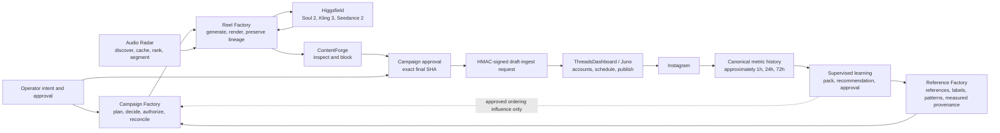
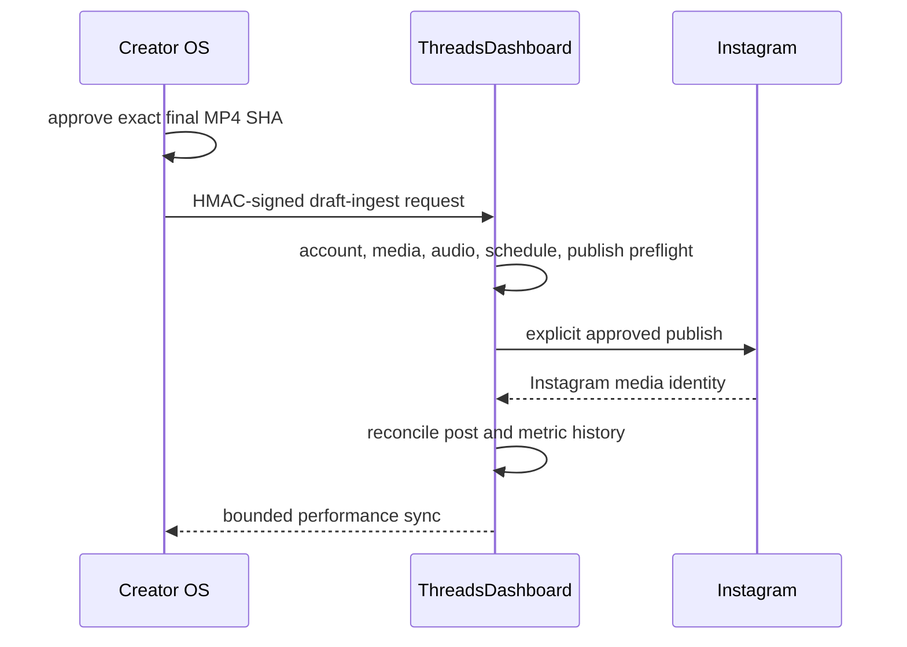
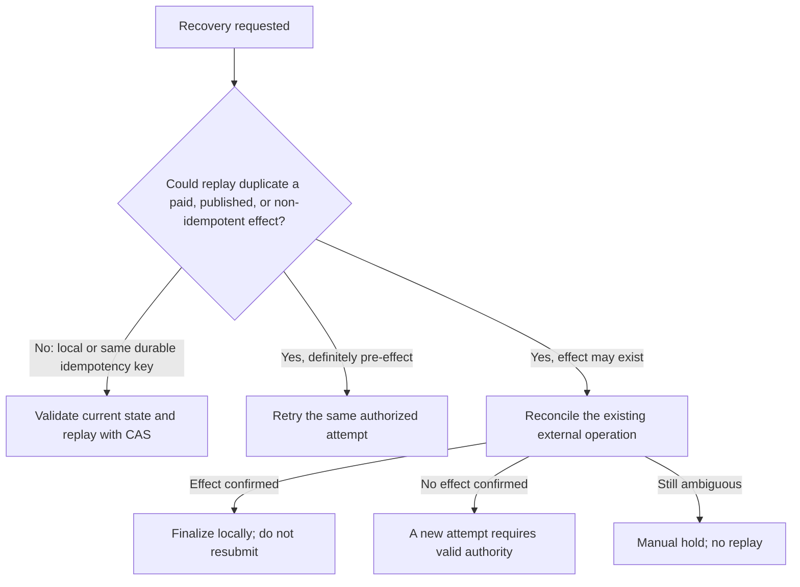

# Creator OS System Map

This is the durable architecture, ownership, product-boundary, and evidence map
for Creator OS. It explains how the system is supposed to work and what each
part is allowed to claim. It does not treat a merged commit, a provider request,
a draft, or a queue receipt as proof that a Reel was published.

For the current source SHA, runtime SHA, checkout condition, and operational
snapshot, use [`PIPELINE_STATE.md`](./PIPELINE_STATE.md) and fresh
`creator-os status` output. Those facts change faster than this map.

For a new ChatGPT session, provide this map, `PIPELINE_STATE.md`, and
`docs/operations/creator_os_master_operating_spec.md`. Together they describe
durable architecture, current operational truth, and active product policy.
The canonical table/write-owner split and handoff-saga rules are in
[`docs/architecture/state_and_ownership.md`](./docs/architecture/state_and_ownership.md);
the corresponding machine-readable registry is
`packages/pipeline_contracts/pipeline_contracts/ownership_registry.v1.json`.

## Repository Closure Snapshot — 2026-07-29

The three-mode simplification is complete and frozen at merge
`289dcf27ecca1a2ba81ddb6b7ddeb2c970d21983` through PR
[#557](https://github.com/adersouza/creator-os/pull/557).

| Layer | Status |
|---|---|
| Architecture | **COMPLETE** — three public creation modes |
| Implementation | **COMPLETE** — merged on `main` |
| Hosted source verification | **COMPLETE** — affected, hygiene, and secret-scan checks passed |
| Runtime promotion | **PENDING** — protected runtime remains on the prior SHA |
| Live visual qualification | **PENDING** — one bounded paid `recreate_reel` run |
| ThreadsDashboard handoff qualification | **PENDING** — only after exact-final operator review |

Freeze this creation-mode architecture. Do not add public modes, restore local
execution to the product CLI, or revive Motion Control, legacy remix, or other
removed execution routes. Prompt authoring may describe talking or dancing
performances, but that does not claim exact supplied-audio lip sync or exact
choreography transfer.

## The System In One Sentence

Creator OS turns approved creator identity and content intent into an
exactly-traceable, technically validated, human-approved Reel; ThreadsDashboard
then owns the account-facing draft, schedule, publication, and real performance
history; supervised learning may later reorder only already-approved creative
choices.

## The Six Truth Levels

Every status report must name the level it proves:

1. **Implemented** — code exists in a checkout.
2. **Locally verified** — tests or read-only checks passed in that checkout.
3. **Merged** — the exact commit is on `origin/main`.
4. **Released** — exact-SHA release and security evidence succeeded.
5. **Promoted** — the separate machine runtime was deliberately moved to the
   exact released SHA and passed runtime verification.
6. **Operationally proven** — an explicitly authorized real action produced
   reconciled provider, media, draft, publication, or metric evidence.

These claims are deliberately separate:

- A local pass is not a merge.
- A merge is not a runtime promotion.
- A runtime promotion is not a generation.
- A provider completion is not creative approval.
- A draft or QStash receipt is not an Instagram publication.
- An Instagram media ID is not a 24-hour or 72-hour outcome.
- Fixture-backed learning proof is not evidence that learning improved a real
  post.

## One-Page Mental Model


```mermaid
flowchart LR
    Operator["Operator intent and approval"]
    Reference["Reference Factory<br/>references, labels, patterns, measured provenance"]
    Campaign["Campaign Factory<br/>plan, decide, authorize, reconcile"]
    Reel["Reel Factory<br/>generate, render, preserve lineage"]
    Higgsfield["Higgsfield<br/>Soul 2, Kling 3, Seedance 2"]
    Audio["Audio Radar<br/>discover, cache, rank, segment"]
    Forge["ContentForge<br/>inspect and block"]
    Approval["Campaign approval<br/>exact final SHA"]
    Export["HMAC-signed draft-ingest request"]
    TD["ThreadsDashboard / Juno<br/>accounts, schedule, publish"]
    Instagram["Instagram"]
    Metrics["Canonical metric history<br/>approximately 1h, 24h, 72h"]
    Learning["Supervised learning<br/>pack, recommendation, approval"]

    Operator --> Campaign
    Reference --> Campaign
    Campaign --> Reel
    Reel --> Higgsfield
    Higgsfield --> Reel
    Audio --> Reel
    Reel --> Forge
    Forge --> Approval
    Operator --> Approval
    Approval --> Export
    Export --> TD
    TD --> Instagram
    Instagram --> Metrics
    Metrics --> Learning
    Learning --> Reference
    Learning -. "approved ordering influence only" .-> Campaign
```

The operator does not manually coordinate six products. The supported
`scripts/creator-os` command delegates to these internal owners and keeps the
cross-component receipts connected.

The canonical gate-by-gate explanation is
[`docs/architecture/approval_to_publication_boundaries.md`](docs/architecture/approval_to_publication_boundaries.md).

## Product Boundary

Creator OS owns:

- creator-bound source inventory and source approval;
- content intent and bounded batch planning;
- supervised Content Director plans;
- provider quote and spend authorization;
- visual generation and provider reconciliation;
- local static rendering;
- overlay placement and rendering;
- Audio Radar discovery, caching, selection, segmenting, embedding, and
  verification for the embedded-audio path;
- media lineage, technical QC, and creative approval;
- validated, signed, draft-only handoff;
- ingestion of canonical performance history;
- knowledge-pack refresh and supervised recommendation consumption.

Creator OS does not own:

- the normal product UI;
- Instagram account authentication or account health;
- final schedule creation;
- Instagram publication;
- QStash production dispatch;
- canonical Instagram publication state;
- production analytics storage;
- ThreadsDashboard deployment.

Those account-facing responsibilities belong to the external
`ThreadsDashboard` repository and Juno product.

## Component Ownership

| Component | Primary question | Owns | Must not own |
|---|---|---|---|
| Reference Factory | What patterns and references are worth considering? | reference intake, Gold/Maybe/Ignore labels, prompt/pattern packs, knowledge-pack export, measured provenance | campaigns, spend, scheduling, publishing |
| Campaign Factory | What should be made, for whom, and is it authorized? | plans, source/account matching, intent, spend, lifecycle, readiness, approval, export, performance ingestion, supervised recommendation state | provider internals, product UI, platform publishing |
| Reel Factory | Can the media be created and rendered with exact lineage? | Soul generation helpers, provider workers, static MP4, captions, placement, local queue, media probes, generation lineage | account selection, schedule state, publication state |
| Audio Radar | Which verified audio object and segment should finish this Reel? | trend discovery, cache lifecycle, track/segment ranking, cooldowns, download/probe/hash, embedding receipt | visual generation, talking-voice synthesis, publishing |
| ContentForge | Is this exact media technically acceptable and sufficiently distinct? | PDQ/SSCD collision evidence, sibling distinctness, OCR, safe zones, readability, watchability, blocking QC | creative taste, account policy, publishing |
| Pipeline Contracts | Does data crossing a boundary have the right shape and semantics? | canonical JSON schemas, Python validation, generated TypeScript validators | business decisions or runtime state |
| Creator OS Core | Which minimal infrastructure is genuinely shared? | auth helpers, atomic files, SQLite helpers, runtime paths, media probes, runtime guard | campaign, media, or publishing business logic |
| ThreadsDashboard | Can this approved draft run on a real account? | UI, Supabase, account projection, final approval, schedule, publish, Instagram reconciliation, analytics | Creator OS generation internals |

Campaign Factory is the only Creator OS control plane. Reel Factory, Reference
Factory, Audio Radar, and ContentForge are workers or bounded domains, not
alternate orchestrators.

## Repository Layout

```text
scripts/creator-os
  canonical operator command

packages/creator_os_core/creator_os_core
  shared runtime paths, authentication, SQLite/file safety, media probes

packages/pipeline_contracts/pipeline_contracts/schemas
  only hand-edited cross-component schemas
packages/pipeline_contracts/typescript/generated-schemas.ts
  generated TypeScript bundle; never hand-edit

python_packages/reference_factory/reference_factory
  reference intake, review, patterns, knowledge packs, provenance

python_packages/reel_factory/reel_factory
  provider workers, rendering, captions, placement, media lineage, local queue

python_packages/campaign_factory/campaign_factory
  planning, production lane, spend, readiness, approval, export, metrics,
  learning, Content Director, Audio Radar

packages/contentforge
  direct headless inspection/QC CLI

tests/integration
  cross-component contracts, runtime, handoff, and operator-surface proof

docs
  active policy, runbooks, provider truth, and labelled historical records
```

Reel Factory has one local SQLite render queue. ContentForge runs as a direct,
bounded headless command and has no HTTP server, daemon, background job API, or
polling queue.

## Three Product Modes

Normal production uses one of three product modes:

```bash
scripts/creator-os create \
  --creator stacey \
  --mode calm_animation \
  --style passive_selfie \
  --count 3 \
  --execution cloud \
  --accounts bennett_s33 \
  --audio embedded_trending_required \
  --max-credits 70
```

The operator names the product mode, optional style, account scope, count,
audio policy, and spend ceiling. The system resolves approved sources, the
creator Soul ID, the pinned Higgsfield recipe, prompts, seeds, and job
identities. Create does not accept a provider or model choice and cannot choose
WaveSpeed or a local model.

Stacey, Larissa, and Lola each have a pinned completed Soul 2 identity. Their
approved creator images are supplied to OpenAI for model-specific prompt
generation; no creator may inherit another creator's Soul or reference image.

`creator-os create` exposes three product modes:

1. `static_reel` — approved creator still to local static MP4;
2. `calm_animation` — OpenAI prompt plus pinned Kling 3 Turbo motion;
3. `recreate_reel` — authorized reference analysis, Soul anchor prompt, and
   model-specific recreation prompt.

This three-mode list is the frozen public contract. Talking, dancing, outfit,
portrait, and lifestyle concepts are prompt/content characteristics inside
these modes, not additional execution modes.

Before any new generation, Campaign Factory automatically reuses enough exact
approved, audited, creator/intent-matched MP4s when their bytes and required
audio receipt verify. This `prefer_exact` policy returns the approved final
bytes unchanged. `--reuse-policy require_fresh` bypasses reuse for deliberate
inventory creation or experiments without adding another product mode. Local
model tooling is standalone research and is not reachable from the Creator OS
product CLI. No create mode schedules or publishes.

Reuse selection and destination reservation are one fail-closed operation only
when `--accounts` resolves to one concrete eligible account. Campaign Factory
atomically creates a pending reservation for each reused asset, exports its
reservation ID with the draft, commits it only after ThreadsDashboard accepts
the draft ingest, and releases a still-pending reservation when ingest fails.
An unresolved or ineligible destination cannot claim destination-ready reuse;
the batch records its blockers and generates the required fresh fallback.
Partial qualified reuse fills only the remaining shortfall. `require_fresh`
creates the full requested batch without consulting reusable inventory.

Missing `variantCooldownCheck` evidence is `unproven`, never implicitly clear.
Read-only operator proof is available through:

```text
creator-os asset explain --sha <FINAL_SHA>
creator-os asset inventory [--campaign <SLUG>] [--surface <SURFACE>]
creator-os asset reservations reconcile [--apply]
creator-os asset reservations cancel --reservation <RESERVATION_ID>
```

The SHA explanation connects retained source, generation attempts and lineage
edges, overlay placement, audio receipt, exact final bytes, review decisions,
reservations, assignments, cooldown evidence, and reuse eligibility. Inventory
reports distinguish gross, reserved, assigned/used, cooldown-blocked, and net
inventory. Reconciliation reports expired and stranded reservations; `--apply`
expires only the reported stale rows.

## Current Creative Product Truth

The operator's real would-post review is the model-selection authority:

| Intent or capability | Status | Active behavior |
|---|---|---|
| Soul still | **SUPPORTED** | Higgsfield Soul 2 with explicit creator Soul ID and exact reference/prompt lineage |
| Static Reel | **SUPPORTED** | deterministic local MP4 from an accepted still; zero provider-video cost |
| Passive selfie / portrait / outfit / lifestyle motion | **SUPPORTED** | `calm_animation` uses product-pinned Higgsfield Kling 3 Turbo with OpenAI-authored prompts and generated sound disabled |
| Animate an already-approved still | **SUPPORTED** | same pinned passive Higgsfield lane |
| Existing finished Creator OS media | **SUPPORTED** | strict intake/reconciliation with retained source, generation, audio, QC, and final-media hashes |
| Prompt-driven reference-Reel recreation | **EXPERIMENTAL** | OpenAI-authored Soul/Seedance/Kling prompt pack from the approved creator image and sampled Reel frames; only the approved anchor and prompt reach Seedance/Kling |
| Prompt-authored dancing performance | **AVAILABLE AS PROMPTED CONTENT** | OpenAI may describe dancing actions for Kling/Seedance; exact source choreography transfer is not claimed |
| Prompt-authored talking performance | **AVAILABLE AS PROMPTED CONTENT** | OpenAI may describe speaking performance; exact supplied-voice lip sync is not claimed |
| Motion copy / exact dance transfer | **UNRESOLVED** | tested Kling Motion Control outputs were rejected; no approved exact-transfer recipe |
| Exact supplied-voice talking selfie | **UNRESOLVED** | no authenticated, operator-approved exact supplied-voice path |
| Talking motion copy | **UNRESOLVED** | neither the transfer base nor exact supplied-audio lip-sync path is approved |
| WaveSpeed O3/Vidu/InfiniteTalk | **REJECTED FOR NORMAL PRODUCTION** | historical receipts remain readable; no active route or fallback |
| Local Wan/LTX/LongCat | **ADVANCED RESEARCH ONLY** | not a normal production default or fallback |
| Arena/Router | **RESEARCH ONLY** | cannot choose normal production models or override product configuration |

Higgsfield is the only active normal visual-generation provider. There is no
silent paid fallback.

## Normal Production Flow

### 1. Resolve the request

The create request binds:

- creator;
- content intent;
- requested count;
- cloud execution;
- account or account group;
- audio policy;
- explicit apply/dry-run state;
- maximum authorized credits.

Dry-run plans and quotes. Apply may create provider jobs and local artifacts,
but still cannot export, schedule, or publish.

### 2. Resolve approved sources

Campaign Factory loads only approved, creator-matched source images whose bytes
still match their stored SHA-256. It checks intent compatibility before any
paid request. Failed or incompatible sources are retained as evidence and
cannot repeatedly waste provider calls in later fan-out.

Learning may reorder this approved set only when an exact
`SUPERVISED_ACTIVE` recommendation matches creator identity, account, intent,
observation cohort, pack fingerprint, and current evidence. Learning cannot
approve a source.

### 3. Materialize independent jobs

`count=N` creates N retained job identities. Each job keeps its own:

- source asset and source SHA;
- prompt and prompt fingerprint;
- seed;
- provider quote;
- spend authorization;
- provider generation/request ID;
- output;
- technical receipt;
- audio selection;
- final MP4 SHA.

One failed job does not erase successful siblings. An ambiguous provider
submission is preserved for reconciliation and is never blindly retried.

### 4. Quote and authorize

The Higgsfield adapter:

1. discovers the authenticated contract;
2. constructs the exact provider request;
3. assigns the durable attempt, then quotes that exact plan;
4. checks the full prepared batch against one authenticated balance snapshot,
   retained minimum, active reservations, and the batch credit ceiling;
5. creates a signed one-time spend authorization;
6. persists the provider attempt and binds the authorization to the exact
   provider request, prompt, seed, source/anchor/reference hashes, command,
   work item, attempt, and quote fingerprint;
7. rebuilds and revalidates that same provider plan immediately before
   consuming the authorization;
8. writes `SUBMISSION_STARTED` evidence before invoking the create command;
9. submits once;
10. polls by generation ID;
11. stages, probes, hashes, checkpoints, and atomically retains the result;
12. records provider-reported actual credits, or explicit unknown cost when
    concurrent account activity makes a balance delta unsafe.

Unknown cost is not zero. An expired, mismatched, reused, or over-cap
authorization fails closed. Actual cost above the authorization is still
recorded, but creates an overspend incident and blocks asset progression.
`providerRequestFingerprint` excludes the local output destination;
`executionFingerprint` adds the output/review destination and runtime plan
version. The remote fingerprint uses exact media and approval identities plus a
path-independent normalized command; balance evidence and timestamps are not
remote-request inputs. Exact completed local receipts recover without another
provider quote or balance read.

### 5. Generate visual media

The active passive recipes are:

| Recipe | Provider model | Duration | Output | Provider audio |
|---|---|---:|---|---|
| Calm animation | `kling3_0_turbo` | 5 seconds | 720p portrait | no sound parameter; returned audio is rejected |
| Reference recreation | `seedance_2_0` Fast | 4–15 seconds | 480p portrait, high bitrate | `generate_audio=false` |

Product configuration chooses between the two operator-approved candidates.
Normal operators do not supply these identifiers.

The still path uses a creator Soul ID explicitly. Reference-conditioned Soul
generation captures Higgsfield's resulting composition prompt and exact input
lineage. The approved original can be paired with a text-only body-emphasis
variant under the repository's established prompt policy. Every accepted still
can produce a free deterministic static MP4 before paid motion.

### 6. Inspect and block

Technical validation includes the checks appropriate to the artifact:

- file exists and is a regular, contained file;
- SHA-256 matches the registered identity;
- FFprobe can decode it;
- duration, aspect, resolution, and streams are acceptable;
- source and output are not accidentally identical where distinct output is
  required;
- sibling outputs are not duplicate bytes;
- ContentForge collision and distinctness evidence;
- OCR, safe-zone, readability, and watchability;
- overlay placement evidence when burned text exists;
- final audio stream and audio-binding evidence.

Automated identity/anatomy evidence is recorded only when a real analyzer
reported it. Missing analyzer output is `unknown`, not approval.

### 7. Add overlay text only when safe

Burned overlay text and the Instagram post caption are different artifacts.

Burned text:

- comes from the approved caption bank;
- uses Reel Factory placement;
- uses Instagram Sans Condensed;
- binds a `captionPlacementDecision`;
- never receives hand-chosen coordinates;
- is omitted when no safe lane exists.

Post captions are Campaign/ThreadsDashboard metadata. Clean MP4s with caption
text below the post are valid and often preferred.

### 8. Fulfill audio

For eligible non-talking content, `embedded_trending` resolves to the required
embedded-audio path:

1. read the canonical active Audio Radar cache;
2. exclude unavailable, incompatible, or cooldown-blocked tracks/segments;
3. rank for creator, account, intent, motion, duration, and trend fit;
4. optionally apply a valid supervised performance adjustment;
5. select a duration-compatible segment;
6. download or reuse cached bytes;
7. probe and hash source audio;
8. process the exact segment;
9. embed AAC into a new final MP4;
10. probe video and audio streams;
11. bind track identity, acoustic fingerprint, segment bounds, processed
    segment SHA, and final MP4 SHA in the receipt;
12. update the Campaign rendered-asset identity to the exact final bytes.

Re-embedding changes the canonical final artifact. Human approval for an older
SHA does not transfer automatically.

Talking intents do not receive trending music over speech. They remain blocked
until the talking product path is resolved.

### 9. Human review

The operator reviews the exact output SHA for:

- correct creator identity;
- face and body stability;
- hands/anatomy;
- attractiveness;
- natural motion;
- casual-phone appearance;
- audio fit;
- motion-copy accuracy or lip-sync only when applicable;
- would-post decision;
- notes.

Blank fields mean unreviewed. A technically valid video may still be rejected.
A beautiful video depicting the reference performer instead of the intended
creator fails identity review.

### 10. Approve and export

Creative Approval binds:

- creator and source identity;
- exact output and final MP4 SHA;
- generation and provider lineage;
- QC evidence;
- overlay decision;
- audio fulfillment;
- disclosure evidence;
- export projection.

`creator-os export --dry-run` writes nothing. `--apply` creates only validated,
HMAC-signed draft-ingest request evidence. It cannot create a schedule or
publish.

## Existing-Media Path

The existing-media workflow is for finished Creator OS media with complete
retained provenance. It is not a generic camera-roll importer.

```text
private intake manifest
  -> resolve source/generation/audio/QC/final hashes
  -> zero-write dry-run
  -> reconcile one canonical rendered asset
  -> exact-SHA operator review
  -> attach to a compatible approved plan item
```

Apply does not copy, re-encode, replace audio, regenerate, or call a provider.
Repeated application is idempotent for the same evidence.

## Reference-Reel Intake And Recreation

The separate `recreate_reel` intent now begins with a canonical Reference
Factory intake stage:

```text
public Instagram/TikTok/Short URL or private local Reel
-> anonymous yt-dlp, then private Chrome Default access only when explicitly required
-> sanitized platform/media identity + exact audiovisual SHA
-> full-source local analysis + literal endpoint and clean-frame derivatives
-> timestamped OCR inventory retained outside the generation prompt
-> read-only timecoded motion/camera analysis when authenticated Gemini is available
-> deterministic hard-block-first anchor receipt
-> exact encoded audio + canonical PCM + Chromaprint evidence
-> one canonical Audio Radar identity and one occurrence per reference
```

`--through analyze` stops at that boundary with zero paid visual-generation
calls. When the authenticated Gemini CLI is available, it may make one
read-only analysis call whose unavailable cost is reported honestly; invalid or
missing analysis never invents semantic actions. Without `--apply`, download,
frames, and audio extraction are temporary and databases are not mutated.
Authorized apply stores private artifacts outside Git with 0700 directories
and 0600 files. Platform/media ID is the primary idempotency key, downloaded SHA
is second, and URL aliases are only a pre-download hint.

The `recreate_reel` planner then continues:

```text
canonical private reference
-> deterministic source classification + bounded coherent excerpt
-> OpenAI-authored Soul anchor plus Seedance/Kling prompts
-> one text-only Soul 2 anchor from the OpenAI scene/composition prompt
-> mandatory human identity + WOULD_USE_AS_ANCHOR review
-> prompt-driven Seedance 2 Fast
-> provider audio disabled/replaced under the automatic audio policy
-> technical QC + mode-specific human review + exact-SHA final audio binding
```

`--through anchor --apply` is an executable boundary, not a planning
placeholder. Campaign Factory issues a one-call Soul spend authorization,
Reel Factory performs the text-only Soul 2 request, downloads the exact image
bytes, writes provider/lineage receipts, and registers the image as an
`imported` recreation-anchor review candidate. The candidate does not become a
canonical creator source. `creator-os recreation approve-anchor` verifies that
registered generation and writes an immutable exact-SHA approval receipt;
Seedance fails closed without that receipt and its retained managed anchor
file.

Paid retries never cross attempt boundaries automatically. An anchor rejection
records `new_soul_anchor`; a final-video rejection records
`retain_anchor_new_seedance`. Either branch requires a new explicit
`--recreation-attempt-id`, producing a new spend fingerprint and one fresh
authorization. Provider and technical completion remain truthful when the
creative decision is rejected; publishability stays blocked and
`learningEligible` stays false.

Final recreation review must compare the output with both the approved anchor
SHA and the canonical creator-reference source SHA. The complete retained chain
is available read-only with:

```text
creator-os recreation explain --job <pipeline-job-id>
```

The explanation includes the reference SHA, selected frame SHA, prompt pack,
Soul generation and spend lineage, anchor approval, Seedance authorization and
generation, resolved reference element, final MP4 SHA, audio receipt, technical
QC, review decisions, and final approval state.

The executable recreation request is Seedance-only. It supplies the approved
anchor as an image reference, the authorized inspiration Reel as a video
reference for broad motion/structure conditioning, and the creator reference
Element as a prompt token. It uses the authenticated `seedance_2_0 mode=fast`
contract at 480p/high bitrate and disables generated audio. Seedance does not
consume the creator's Soul ID directly; Soul owns the upstream anchor
generation. The OpenAI-authored timecoded prompt excludes OCR-recognized source
writing. The separate Kling prompt is retained as planning evidence only and
has no executable recreation route.

OpenAI returns only an affirmative Soul anchor prompt, a Seedance prompt, a
Kling prompt, and a motion/camera timeline. The response schema has no negative
prompt field, every returned text field rejects negative-prompt language, and
the final Soul/Kling contracts reject a `negativePrompt` property. Creator
identity protection comes from the approved creator image, explicit Soul ID,
structured identity guards, and provider settings rather than textual negative
lists.

Prompt planning is cached by the creator-image SHA, reference-video SHA, model,
intent, builder version, instruction, and response schema. A cache hit makes no
OpenAI call. A cache miss requires the current create operation's explicit
`--apply` authorization before any paid OpenAI request. Before that request,
Campaign Factory persists and verifies a signed, five-minute, request-fingerprint
scoped one-call authorization with an operator-configured maximum USD quote.
The prompt pack then records that authorization receipt and the exact structured
result, response ID, token usage, and honestly reported actual-cost status;
unavailable API cost remains `not_exposed`, never zero.

It does not register the inspiration Reel as a rendered asset, does not replace
normal passive creation, and does not restore rejected Motion Control. AUTO
routes active reference recreation through the prompt-driven lane. Seedance is
never represented as exact character replacement or exact choreography;
talking results require an explicit lip-sync operator verdict.

The retired `reference_video_remix_plan.v1` contract remains available only as
a historical reader. It hard-codes paid generation and publishing to false and
has no executable route.

## Fixed-Asset Learning Cohort

An explicit fixed cohort attaches exact already-approved assets without
pretending the Content Director generated them:

```text
three canonical assets
  -> one supervised MECHANICAL_LEARNING_PROOF cohort
  -> three consecutive eligible account-local days
  -> same approximate local posting window
  -> ThreadsDashboard remains final scheduling authority
  -> real 1h/24h/72h observations from each actual publication timestamp
```

The cohort permits repeated intent because the operator chose the exact assets.
It does not change normal rolling-plan diversity or claim causal creative
learning. Observation windows may overlap; publication does not wait for the
previous Reel's 72-hour observation.

## Audio Radar

### Discovery priority

Instagram:

1. SocialCrawl Instagram trending music when available.

TikTok:

1. SocialCrawl TikTok trending videos;
2. optional TikTok Creative Center enrichment;
3. TikLiveAPI resolution for selected TikTok music IDs.

TikLiveAPI is an audio resolver, not the primary trend feed. TikTok videos are
aggregated by actual music ID. Evidence uses only fields actually returned by
the provider: appearances, engagement, recency, timestamp-derived velocity when
possible, cross-platform matches, and local usage/performance.

### Cache safety

- A provider failure is not a successful absence.
- An invalid empty response is not a successful absence.
- An all-source outage cannot age or prune active tracks.
- A valid successful feed may record a genuine omission.
- Pruning requires at least two valid consecutive absences plus retention and
  winner protections.
- Historical metadata remains after eligible cached bytes are pruned.
- The per-run download limit is the command's `--max-new` value.
- TikTok sound owner is stored separately from canonical performer metadata.

### Selection safety

Production selection uses:

- actual publication time for account-track fatigue;
- active `audio_selections.selected_at` records to exclude unpublished draft and
  scheduled inventory;
- bounded 7-day normal, 3-day measured-winner, and 2-day pinned account
  cooldowns with an absolute 24-hour floor;
- a 14-day segment cooldown per creator, including winners and pinned tracks;
- within-batch track and segment uniqueness where practical;
- duration compatibility;
- cached playable bytes;
- exact source and processed hashes;
- no fixture audio for real production unless an explicit fixture environment
  is deliberately enabled for tests.

Audio trend strength and internal performance are separate signals. A trending
track is not automatically an internal winner.

The full Campaign receipt binds the cached track bytes, exact decoded PCM
segment, embedding operation, and final MP4. Its compact downstream audio intent
retains `embeddingReceiptSha256`, `processedSegmentSha256`, exact segment bounds,
`acquiredAudioSha256`, `finalMediaSha256`, and `finalAudioFingerprint`.
Embedded fulfillment is `EXACT_BYTE_VERIFIED`. Native attachment is
`REQUEST_BOUND_AND_TYPE_CONFIRMED`; manual native handoff is
`OPERATOR_CONFIRMED`. Those evidence classes are not interchangeable.

ThreadsDashboard submits the exact approved MP4 source bytes without replacing
embedded audio. Meta may transcode them; the local final SHA proves the outbound
source, while the Instagram media ID proves platform publication.

Successful acquisition and byte lineage do not prove usage rights. Rights
status, source, territory, account scope, commercial-use permission, expiry,
and evidence remain a separate fail-closed gate wherever the campaign requires
them.

For non-speaking visuals, embedding replaces existing audio. The worker also
has a speaking mix primitive that preserves source speech and lowers music to
`speech_music_volume`; this is not proof of a supported talking or lip-sync
product workflow.

## Media Quality Evidence

The local pose-continuity analyzer uses Apple Vision body and hand landmarks to
record sampled frames, coverage, discontinuity candidates, and exact
media/toolchain/source fingerprints. This is technical continuity evidence
only: it does not approve anatomy, identity, attractiveness, or would-post
quality. Those decisions remain explicit human review fields. Historical
trusted analyses with the previous five-analyzer set remain readable; new
analyses bind the current six-analyzer set exactly.

The public ContentForge `motion-qc` surface accepts only canonical trusted-media
analysis, the exact AnalyzerRegistry snapshot, and a complete structured human
review. Raw analyzer values remain diagnostic-only and cannot produce a
Campaign-eligible receipt. The resulting
`contentforge.motion_specific_qc_receipt.v2` embeds and fingerprints all three
records. Campaign Factory independently revalidates their media/source links,
receipt and record fingerprints, analyzer identities, and current
implementation file hashes before storing an immutable registration. Legacy v1
receipts remain historical evidence but are not publishability evidence.

Trusted analysis operates on an immutable private snapshot, rejects symlinks
and non-regular media, and rehashes before signing. The legacy temporal-PDQ
approximation is excluded from normal Campaign and ContentForge audits; it may
still be requested explicitly for historical comparison, and its existing
receipts remain readable. Speaking-video evidence uses actual Apple Vision
inner/outer-lip landmarks at 12 fps plus decoded PCM: at least 36 usable
samples are split into 24+ training and 12+ holdout observations, lag is chosen
only on training data, and support is computed once on holdout with a
one-sided Fisher statistic against the practical-null correlation. Fixed face
rectangles, best-of-small-sample scores, and direct correlation-to-confidence
mapping are rejected. Missing audio, speech, landmarks, face coverage, samples,
or exact toolchain identity is a blocked measurement, never an inferred pass.

Reel Factory focal-safe placement uses MediaPipe Tasks PoseLandmarker, not the
removed `mediapipe.solutions` API. The official pose-landmarker model URL and
SHA-256 are pinned, model bytes are verified before use, and one inference is
reused per sampled frame. Missing or drifted model evidence fails detection
cleanly rather than inventing a safe overlay lane.

Overlay OCR runs even when the plan declares no burned text. A completed scan
with no detected text is the only no-overlay pass; undeclared text or app UI
blocks. Declared overlays must independently pass measured pixel delivery and
the canonical Pipeline Contracts semantic-payoff policy, so a dangling setup
cannot pass merely because its pixels are readable.

## Content Director

The Content Director is a Campaign Factory domain, not an autonomous service.
It makes versioned plans from approved inventory, approved patterns, account
projections, explicit constraints, and supervised learning.

### Autonomy modes

| Mode | May do | May not do |
|---|---|---|
| `SHADOW` | explain and propose | persist production changes, generate, export, schedule, publish |
| `SUPERVISED` | persist an operator-reviewed bounded plan and execute separately authorized stages | approve media, invent spend, schedule, publish |
| `APPROVED_PLAN_AUTOPILOT` | execute only the immutable already-approved item set inside signed bounds | add items, change identity/provider/experiment, retry ambiguity, publish |

There is no unrestricted Creator OS autopublisher.

### Plan state model

```text
DRAFT -> REVIEWED -> APPROVED
  -> GENERATION_READY -> GENERATING -> RECONCILING -> REVIEW_READY
  -> CREATIVE_APPROVED -> EXPORT_READY -> EXPORTED
  -> SCHEDULE_READY -> SCHEDULED -> PUBLISHING -> PUBLISHED
  -> MEASURING -> LEARNED
```

`BLOCKED`, `REJECTED`, and `CANCELLED` are explicit terminal or recovery
branches. Existing assets use:

```text
APPROVED -> EXISTING_ASSET_READY -> CREATIVE_APPROVED
```

Creator OS may record reconciled downstream state, but the actual external
schedule and publication authority remains ThreadsDashboard.

### Scheduling policy

- Healthy eligible accounts target their configured daily cadence.
- Every-other-day cadence is reserved for warming, health/platform limits,
  insufficient approved inventory, or explicit operator choice.
- Each account advances independently.
- Current deterministic proposals use account-local timezone and a 20-hour
  minimum gap unless stronger account policy requires more.
- Fixed cohorts use consecutive eligible local dates.
- Pending and stale ThreadsDashboard schedules must be reconciled before new
  external schedules are created.
- `learnedTiming=false` remains explicit unless a valid supervised timing
  recommendation actually applied.
- 1h, 24h, and 72h observations are calculated from actual publication time
  and may overlap.

ThreadsDashboard makes the final scheduling decision. Its read-only smart-time
plan may prefer a learned hour only from comparable 24-hour metric-history
snapshots, then applies active hours, account gaps, cross-plan minimum spacing,
and deterministic jitter. The receipt includes the safe-slot baseline and
whether the learned preference actually changed the timestamp.

## Publication Boundary


```mermaid
sequenceDiagram
    participant C as Creator OS
    participant T as ThreadsDashboard
    participant I as Instagram

    C->>C: approve exact final MP4 SHA
    C->>T: HMAC-signed draft-ingest request
    T->>T: account, media, audio, schedule, publish preflight
    T->>I: explicit approved publish
    I-->>T: Instagram media identity
    T->>T: reconcile post and metric history
    T-->>C: bounded performance sync
```

Publication closure requires the real Instagram media ID and exact media
identity. Upload success, route success, schedule insertion, notification, or
QStash dispatch alone is insufficient.

## Failure Recovery

The recovery boundary is not whether an operation is external. It is whether
replay could create a duplicate paid, published, or otherwise non-idempotent
effect.


```mermaid
flowchart TD
    A["Recovery requested"] --> B{"Could replay duplicate a paid, published, or non-idempotent effect?"}
    B -->|No: local or same durable idempotency key| C["Validate current state and replay with CAS"]
    B -->|Yes, definitely pre-effect| D["Retry the same authorized attempt"]
    B -->|Yes, effect may exist| E["Reconcile the existing external operation"]
    E -->|Effect confirmed| F["Finalize locally; do not resubmit"]
    E -->|No effect confirmed| G["A new attempt requires valid authority"]
    E -->|Still ambiguous| H["Manual hold; no replay"]
```

Every side-effecting receipt separates:

- `workItemId`: the logical task;
- `authorizationId`: the approval or spend authority;
- `attemptId`: one concrete execution;
- `externalOperationId`: the provider generation, container, message, or media
  identity.

Safe recovery points:

| Failure | Safe retry point | Replay rule |
| --- | --- | --- |
| Stale queued pipeline job | `PRE_EFFECT` | Requeue with the same work item. |
| Stale running local or registered idempotent job | Typed safe-replay policy | Replay with CAS and the same durable identity. |
| Stale running job with unknown effect state | None | Terminal manual hold; reconcile before any new authorized attempt. |
| Higgsfield generation ID known | Existing provider generation | Poll/download the same generation; never submit again. |
| Higgsfield submission ambiguous without an ID | Exact provider-history match | Search the bounded submission window using the stored request fingerprint inputs. Bind and resume only one exact match; zero or multiple matches remain on manual hold. |
| Instagram/Threads publish response lost | Existing container plus account/provider history | Persist `unknown_external_effect`, keep `publishing`, and exclude from automatic retry and stale cleanup. |
| Provider proves no publication | `resolved_no_effect` | Retry only under still-valid publication authority. |
| Missing metric while its window is open | Exact post/platform/window ledger row | Redispatch with a new dispatch-attempt identity; upsert the same observation identity. |
| Metric window expired without a durable observation | None | Persist `MISSED_EXPIRED`; never substitute later counters. |
| Retracted learning projection | Immutable raw snapshot | Retract the projection. Current-pack matching immediately makes recommendations from the previous pack unusable. |

Higgsfield pre-submission evidence includes the request fingerprint, work,
authorization and attempt IDs when supplied, quoted amount, scrubbed provider
account/balance snapshot, submission time, model, source hash, seed, and client
correlation ID. If submission returns no generation ID, recovery searches
provider history inside the recorded time window and compares model, exact
prompt, duration, aspect ratio, and seed when present. Exactly one match is
bound to the original attempt and resumed. Zero or multiple matches remain a
manual reconciliation hold and never authorize resubmission.

QStash uses three distinct identities:

```text
schedule identity     = post ID + scheduled timestamp
dispatch attempt      = unique message/delivery attempt
publication identity  = the single canonical post claim
```

A new QStash dispatch attempt may target the same schedule identity; the
receiver's state check and atomic publication claim ensure only one publication
identity wins. Reusing a prior QStash deduplication ID may suppress redispatch.

## Performance And Learning

### Canonical return path

```text
Instagram publication identity
  -> ThreadsDashboard metric history
  -> Campaign performance snapshots
  -> Reference measured provenance
  -> versioned knowledge pack
  -> Campaign import and scoped recommendations
  -> explicit operator review
  -> normal create consultation
  -> decision receipt
```

### Eligibility

A recommendation may affect production only when:

- at least three canonical measured outcomes support an operator-reviewed
  early advisory;
- publication identity is real and confirmed;
- creator identity matches;
- exact account scope matches;
- content intent matches;
- source and final-media lineage validate;
- observations share an equal-age 24-hour or 72-hour cohort;
- the pack and recommendation fingerprints are current;
- an operator explicitly activated it.

One-hour evidence is advisory. Missing metrics remain missing, never zero.
Fixtures, fallbacks, failed publications, invalid lineage, pre-cutover rows,
and mismatched observation ages are excluded.

Evidence language is intentionally bounded:

- 3-4 comparable outcomes: `early_advisory`;
- 5-9: `preliminary_direction`;
- 10 or more: `stronger_directional_evidence`;
- an explicitly controlled matched experiment: `causal_evidence_candidate`.

Account-group, creator-wide, and global rollups are emitted as advisory
hierarchical evidence only. They do not override or satisfy the exact-account
production match.

The frozen default reward remains
`account_normalized_decay_shrinkage.v1`. An explicitly supplied supported
learning objective selects `objective_weighted_outcome.v2`, which weights
saves, shares, watch quality, profile visits, follows, and link actions
according to that objective. The v1 formula is not changed in place.

### Recommendation states

- `INELIGIBLE`
- `ADVISORY`
- `SUPERVISED_ACTIVE`
- `EXPIRED`
- `BLOCKED`

Score alone never activates a recommendation. Reject, pin, and revoke are
explicit operator decisions. Revocation prevents later consumption.

### What learning may change

- ordering among already-approved creator sources;
- ordering among imported approved prompt/hook patterns;
- Audio Radar soft ranking when exact publication-linked audio evidence exists.

### What learning may not change

- creator identity or Soul ID;
- approved-source status;
- Higgsfield as normal provider;
- Kling-versus-Seedance product configuration;
- hard QC;
- spend ceilings;
- account authorization;
- safety policy;
- publication eligibility.

Every create run records whether learning was consulted, eligible, applied, and
whether the final choice actually changed. Consultation without a changed
choice is not labeled adaptive.

## Contracts And Lineage

Canonical schemas live only in:

```text
packages/pipeline_contracts/pipeline_contracts/schemas
```

The TypeScript bundle is generated:

```text
packages/pipeline_contracts/typescript/generated-schemas.ts
```

The workflow for a contract change is:

1. edit the canonical JSON schema;
2. run `pnpm sync:contracts`;
3. run `pnpm check:contracts`;
4. review and merge;
5. publish the immutable contract package;
6. update ThreadsDashboard's pinned package and lockfile.

Never copy schemas into ThreadsDashboard or hand-edit generated TypeScript.

### Identity spine

The important immutable identities are:

- creator and identity profile;
- Soul ID;
- account and account group;
- source asset ID, path, and SHA;
- intent;
- prompt and prompt fingerprint;
- generation job/attempt ID;
- provider model/tool and request ID;
- raw output SHA;
- caption placement and caption hash;
- audio platform/music ID;
- source track SHA and acoustic fingerprint;
- segment start/end and processed segment SHA;
- final MP4 SHA;
- Creative Approval ID;
- draft ID;
- Instagram media ID;
- metric snapshot IDs;
- knowledge-pack and recommendation fingerprints.

The chain is append-only where history matters. A new output, re-embed, retry,
or publication creates new evidence instead of rewriting the old attempt.

## State And Storage

```text
/Users/aderdesouza/Developer/creator-os
  reviewed source integration checkout

/Users/aderdesouza/Developer/creator-os-runtime
  clean detached machine runtime pinned to one promoted SHA

/Users/aderdesouza/Developer/ThreadsDashboard
  external product source checkout

~/.creator-os/state/
  canonical SQLite state

~/.creator-os/artifacts/
  canonical generated media and evidence

~/.creator-os/models/
  retained local QC/research model files

~/.creator-os/logs/
  machine runtime logs

~/.creator-os/generation.env
~/.creator-os/performance-sync.env
~/.creator-os/campaign-ingest.env
  private configuration; never committed
```

Primary databases:

- Campaign Factory: campaign decisions, assets, approvals, plans, exports,
  performance, recommendation imports;
- Reference Factory: corpus, labels, patterns, measured provenance;
- Reel manifest: generation/render/cache evidence;
- Reel render queue: the single machine-local render queue.

Repository cleanup must not delete canonical databases, private configuration,
active media, lineage, receipts, models required by QC, backups, or migration
evidence.

## Runtime Promotion

Runtime promotion is a separate, guarded transaction:

```text
clean exact origin/main SHA
  -> authenticated operator authority
  -> live protected-branch validation
  -> exact-SHA release and security evidence
  -> runtime lock
  -> Git bundle and backup manifest
  -> clean detached checkout update
  -> dependency reconstruction or verified fingerprint reuse
  -> runtime verification
  -> 9/9 credential-scrubbed live-read-only health
  -> authenticated promotion receipt
```

The single-owner authorization policy requires:

- strict, admin-enforced branch protection;
- required PR contexts: `affected`, `hygiene`, and `Secret scan`;
- all live required PR contexts successful;
- separate exact-target-SHA successful `release`;
- exact-target-SHA `Secret scan`, CodeQL JavaScript/TypeScript, CodeQL Python,
  and Trivy evidence from trusted workflows;
- authenticated write-capable operator;
- no invented second reviewer.

The historical independent-review authority path remains valid. Release and
security workflow names do not have to be permanent branch-protection contexts
for promotion to inspect them.

Promotion cannot generate, export, schedule, publish, mutate production
databases, change credentials, or deploy ThreadsDashboard.

## Verification Tiers

| Tier | Purpose |
|---|---|
| Focused tests | quickest proof for the changed package or behavior |
| `make affected` | canonical changed-scope PR development path |
| `pnpm check:all` | contracts, lint/format, types, architecture, artifacts |
| `make verify` | broad local source verification |
| `make release` | exact-SHA merged-main release evidence |
| Security workflow | Secret scan, CodeQL, Trivy |
| Runtime verification | exact promoted checkout and read-only health |

Affected and hygiene avoid repeating unchanged full suites during PR
development. Exact-SHA release and security evidence remain mandatory for
promotion.

## Machine Automation

Repository-owned launcher scripts may support:

- Audio Radar refresh;
- ThreadsDashboard performance sync;
- learning-cohort daily control;
- weekly improvement digest;
- Campaign Factory runtime launcher.

The LaunchAgent definitions and their credentials are machine-local. A script
existing in source does not prove a schedule is installed or enabled.

The learning-cohort daily controller is not a generator or publisher. It
advances only a due, reconciled cohort day and blocks when an earlier handoff
remains unresolved.

## Canonical Operator Surface

| Command | Authority |
|---|---|
| `creator-os status` | read-only source/runtime/config/database status |
| `creator-os status --live-read-only` | credential-scrubbed provider and handoff probes; zero generation/product writes |
| `creator-os doctor` | read-only fixture-backed integrity audit |
| `creator-os sources` | inspect or explicitly approve creator-bound sources |
| `creator-os media` | reconcile fully attributable existing Creator OS media |
| `creator-os plan` | create or operate supervised local plans and cohorts |
| `creator-os reference-refresh` | preview/apply local Reference and audio catalog refresh |
| `creator-os audio status` | read-only active-library summary |
| `creator-os audio refresh` | bounded private discovery/cache refresh; no Reel or publishing |
| `creator-os audio explain --final-sha <sha256>` | read-only track, segment, cooldown, rights, approval, and publication lineage for one final MP4 |
| `creator-os create` | three-mode production dry-run/apply; no export/schedule/publish |
| `creator-os video-bakeoff` | inspect retained provider bakeoff evidence only |
| `creator-os quality-benchmark` | validate the fixed exact-source creative benchmark without generation |
| `creator-os review` | read-only creative/QC review |
| `creator-os approve` | immutable exact-SHA creative approval |
| `creator-os export` | bounded validated draft handoff only |
| `creator-os performance-sync` | preview/apply canonical metrics ingestion |
| `creator-os status --drafts` | read-only stale-draft inventory with required re-export/re-approval actions |
| `creator-os learning-reset --post-id ... --snapshot-at ... --destination ... --operator ... --reason ... --apply` | exact compare-and-swap reset of one capped metric observation with a durable operator receipt |
| `creator-os learning-refresh` | versioned pack export/import and recommendation refresh |
| `creator-os learning-review` | list, approve, reject, pin, or revoke recommendations |
| `creator-os advanced` | developer-only local model, queue, benchmark, Arena, Router, analyzer diagnostics |
| `creator-os promote` | guarded source-to-runtime promotion only |

There is intentionally no Creator OS `schedule` or `publish` command.

## Failure And Recovery Map

| Failure | Required behavior |
|---|---|
| Source file missing or SHA drifted | reject before provider quote |
| Portrait/source incompatibility | reject before paid submission |
| Quote missing or over cap | stop before provider call |
| Ambiguous submission | retain request evidence and reconcile; do not retry blindly |
| One job fails in a batch | preserve successful siblings |
| Provider output missing/corrupt | retain provider receipt; do not register as usable |
| No safe caption lane | omit burned overlay |
| Audio cache exhausted | block required embedded-audio completion |
| Audio provider outage | preserve active library and absence counters |
| Final MP4 SHA changes | require new binding and review |
| QC blocker | stop readiness/export |
| Account projection missing/stale | stop account eligibility |
| Draft handoff succeeds but no Instagram ID | publication remains unproved |
| Metrics absent | preserve missing state; never write zero |
| Recommendation mismatched or revoked | deterministic no-learning fallback |
| Promotion evidence missing/wrong SHA | stop before runtime mutation |
| Promotion verification fails | automatic rollback and authenticated recovery evidence |

## Active, Advanced, Historical, And Removed

### Active product code

- direct reference-image Soul generation;
- static MP4;
- Higgsfield Kling 3 / Seedance 2 passive motion;
- canonical URL/local reference intake, analysis, audio identity, anchor
  planning, and approval-gated recreation modes;
- placement and caption rendering;
- Audio Radar embedded-audio fulfillment;
- ContentForge direct QC;
- Campaign planning, approval, export, performance, and supervised learning;
- fixed existing-media cohorts.

### Advanced or research-only

- local Wan/LTX/LongCat execution;
- Arena, Router, benchmark, analyzer registry, local model promotion;
- provider bakeoff and creative-quality benchmark tools;
- reference compilation experiments.

Advanced code cannot become a normal production fallback without an explicit
product decision and operator-approved evidence.

### Historical evidence that remains readable

- WaveSpeed jobs, costs, receipts, hashes, media, and lineage;
- older local-model/Arena evidence;
- prior runtime promotion receipts;
- older schema versions through their read-only compatibility paths.

Superseded migration plans and cleanup reports were removed from the working
tree; Git history remains their archive.

### Removed product weight

- active WaveSpeed normal-production routing;
- Grok/grid/cropped-panel generation as a normal path;
- duplicate schema mirrors and root shim;
- duplicate package-local GitHub workflows;
- unused ContentForge job/polling layer;
- Redis/RQ Reel queue;
- obsolete wrapper scripts, empty experiment packages, and duplicate split-repo
  source copies.

## What “Creator OS Is Working” Means

The detailed QC, exact-SHA, warning, rejection, and operator-authority contract
is canonical in `docs/architecture/qc_and_review_gates.md`.

For source:

- contracts, architecture, types, lint, artifacts, and tests pass;
- the exact commit is merged and released.

For runtime:

- source and runtime SHAs match;
- runtime checkout is clean;
- 9/9 read-only health passes.

For a Reel:

- exact creator/source/prompt/provider/output lineage exists;
- technical QC passes;
- operator approved the exact final SHA;
- embedded audio is verified when required;
- the final draft validates and is signed.

For publication:

- ThreadsDashboard reconciled the real Instagram media ID and exact media.

For learning:

- equal-age real outcomes exist;
- the recommendation is eligible and explicitly approved;
- a later decision receipt proves the learned evidence actually changed an
  allowed choice.

No shorter claim should silently substitute for these proofs.

## Documentation Authority

Use documentation in this order:

1. `AGENTS.md` — active repository working rules.
2. `CREATOR_OS_SYSTEM_MAP.md` — durable architecture and product boundary.
3. `README.md` — concise supported operator entrypoints.
4. `PIPELINE_STATE.md` — current dated source/runtime snapshot.
5. `docs/operations/creator_os_master_operating_spec.md` — active product
   policy and invariants.
6. Active architecture/provider/runbook documents under `docs/`.
7. Dated audits and explicitly historical documents — evidence from their
   capture date only.

If an old audit conflicts with current architecture, the current system map and
actual code win. If a volatile SHA, account, provider balance, schedule, or
metric count matters, refresh it from the live read-only surfaces.
