# Approval-to-Publication Authorization and Evidence Boundaries

Creator OS and ThreadsDashboard enforce six authorization gates and preserve
five distinct evidence states. No earlier artifact grants authority belonging
to a later gate.

```mermaid
flowchart LR
    Review["Operator visually examines exact final SHA<br/>human process"]
    Approval["Creator OS creative approval v2<br/>canonical durable approval"]
    Readiness["Creator OS export readiness<br/>hard blockers / overridable warnings"]
    Request["HMAC-signed draft-ingest request<br/>integrity, origin, freshness, replay protection"]
    Ingest["ThreadsDashboard ingest validation"]
    Draft["Persisted draft"]
    Schedule["Scheduling authorization"]
    Receipt["Scheduled state + persisted QStash receipt"]
    PostApproval["ThreadsDashboard post approval"]
    PublishGuard["Publish-time account, outbound, media authorization"]
    Attempt["Provider attempt/container<br/>or approved notify handoff"]
    Identity["Real Instagram media identity"]
    Published["Media ID bound to published post"]
    Metrics["Metric-history observations<br/>approximately 1h / 24h / 72h"]

    Review --> Approval --> Readiness --> Request --> Ingest --> Draft
    Draft --> Schedule --> Receipt --> PostApproval --> PublishGuard --> Attempt
    Attempt --> Identity --> Published --> Metrics
```

## Authorization gates

1. The authenticated operator's `creator-os approve` action creates canonical
   Creative Approval v2 for the exact projected draft, QC evidence, content
   semantics, operator attestation, and final media SHA. Visual examination is
   a human process; it is not a separate mandatory database artifact.
2. Creator OS export readiness distinguishes:
   - hard blocker: export forbidden;
   - warning: export forbidden by default;
   - clean readiness: export may proceed.
   A warning override requires an explicit reason and records warning codes,
   operator identity, the exact payload fingerprint, and timestamp. Hard
   blockers cannot be overridden.
3. The HMAC authenticates a draft-ingest request. It grants no approval,
   schedule, or publication authority.
4. ThreadsDashboard independently validates and persists only a draft.
5. ThreadsDashboard separately authorizes scheduling and requires the
   scheduled state plus persisted QStash receipt.
6. Both auto/API and notify/manual Instagram branches require
   `approval_status = approved`. Publish-time account, outbound, media, and
   eligibility checks remain independent.

Creator OS live export remains draft-only. Scheduling, notification, provider
execution, manual handoff, and publication are owned by ThreadsDashboard.

## Evidence states

| Evidence | Proves | Does not prove |
|---|---|---|
| Creative Approval v2 | Exact Creator OS creative state was authorized | Export, schedule, or publication authority |
| Warning-override receipt | Named operator accepted specific overridable warnings for one payload fingerprint | Permission to bypass hard blockers |
| HMAC-signed draft-ingest request | Integrity, authenticated origin, freshness, replay resistance | Draft persistence or publication |
| Persisted draft | ThreadsDashboard accepted a draft payload | Schedule or publication |
| Schedule plus QStash receipt | A bounded dispatch request was persisted | Handler execution or Instagram publication |
| ThreadsDashboard post approval | Exact post state was authorized for a publication attempt or notify handoff | Handler execution, provider acceptance, or publication |
| `publish_attempts` row | A bounded provider attempt and recorded outcome occurred | Publication without a real media ID |
| Container ID | Provider upload/container creation | Finished publication |
| Manual confirmation | Operator asserted native publication | Real platform identity or metrics |
| Reconciliation receipt | One Instagram media object was bound to the Campaign post with a recorded method and confidence | Performance or causal learning |
| Bound media ID plus `published` row | Canonical application publication evidence | Later metric observations |
| Metric-history observation | Metrics captured in its recorded approximate age bucket | Causal improvement |

## Manual reconciliation

Notify completion records an operator assertion and moves the post to
`publishing`; it does not create `published_at`. Account sync promotes the post
to `published` only after binding a real Instagram media ID.

Matching is fail-closed and ordered:

1. unique permalink shortcode: `confidenceClass = exact`;
2. unique exact-caption match: `confidenceClass = unique_heuristic_match`;
3. unique time-window match: `confidenceClass = unique_heuristic_match`.

Zero candidates remain unresolved. Multiple candidates are ambiguous and are
not reconciled. A successful receipt records `matchMethod`, `candidateCount`,
`matchedMediaId`, `confirmedPublishedAt`, `confidenceClass`, and
`reconciledAt`.

## Metric age semantics

The named cohorts are approximate:

- approximately 1h: 0.5-2 hours;
- approximately 24h: 20-28 hours;
- approximately 72h: 66-78 hours.

## Proof scope

Architecture-mapping blockers: none.

Operational proof still requires separate live evidence for draft handoff,
schedule receipt, provider or manual publication, platform reconciliation, and
metric-history observation. This source map does not claim those actions ran.

## Required scope for the asset-lineage and reuse map

Do not assume Creator OS owns destination-account reservation, source-family
cooldown enforcement, or scheduling duplicate prevention. Identify the actual
owner of every gate. Map where exact-final reuse can succeed before destination
reservation, and what happens if that reused asset later fails account,
cooldown, or reservation eligibility: fresh generation, another owned asset,
block, or unresolved decision.

Keep these states separate: asset exists, asset is approved, asset is
owned-library eligible, asset is exact-reuse eligible, asset is eligible for
this account and intent, asset is reserved, asset is handed off, asset is
scheduled.
