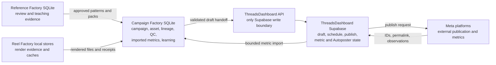

# Creator OS State and Write-Ownership Map

This is the ChatGPT-facing source of truth for deciding **which repository and
database to change**. It maps the checked-out source as of 2026-07-29; it does
not claim that every migration has been applied to production.

## The rule that prevents wrong-repository fixes

State is canonical only inside its owning domain:

- **Creator OS SQLite** owns campaign intent, creator inputs, generated assets,
  generation lineage, QC evidence, imported performance snapshots, and Campaign
  Factory learning.
- **ThreadsDashboard Supabase** owns dashboard drafts, uploaded delivery media,
  schedules, publish attempts, platform publication identity, metric history,
  and ThreadsDashboard Autoposter learning.
- **Meta/Instagram/Threads** owns the external publication and metric facts.
  ThreadsDashboard reconciles those facts into Supabase.
- **Pipeline Contracts** owns cross-repository payload shapes. It does not own
  runtime rows.

An ID appearing in both databases is a join key, not shared write ownership.

## Canonical ownership matrix

| State | Canonical store | Canonical tables or artifacts | Repository that owns writes | Non-canonical copies |
|---|---|---|---|---|
| Campaign definition and control | Campaign Factory SQLite | `campaigns`, `models`, `accounts`, `model_account_profiles`, `creative_plans`, `creative_plan_events`, `manager_decisions` | `creator-os`, Campaign Factory | Supabase campaign links and schedule batches are delivery/control projections |
| Content plan versions | Campaign Factory SQLite | `creative_plan_versions`, `creative_plan_items`, `creative_plan_item_events`, `creative_plan_experiments`, `creative_plan_metric_cohorts` | `creator-os`, Campaign Factory | Draft and schedule rows in ThreadsDashboard |
| Creator source assets | Campaign Factory SQLite plus immutable files | `source_assets`, `asset_components` | `creator-os`, Campaign Factory ingestion | Supabase `media` is a delivery/upload copy |
| Generated and finished assets | Campaign Factory SQLite plus exact file bytes | `rendered_assets`, `variant_assets`, `variant_families`, `caption_families`, `caption_versions` | `creator-os`; Reel Factory produces files, Campaign Factory registers campaign state | Supabase `media` and `posts.media_urls` |
| Generation lineage | Campaign Factory SQLite | `generation_output_blobs`, `generation_attempts`, `generation_lineage_edges`, `content_graph_nodes`, `content_graph_edges`, `content_graph_sync_state` | `creator-os`, Campaign Factory | `campaign_factory_post_links` preserves the delivery join but is not generation lineage |
| QC and creative approval | Campaign Factory SQLite plus content-addressed receipts | `audit_reports`, `motion_qc_receipts`, `approval_decisions`; Creative Approval v2 receipt files | `creator-os`; Reel Factory and ContentForge produce evidence, Campaign Factory persists workflow state, operator supplies human decisions | `posts.approved_by` and `posts.rejected_by` are dashboard workflow fields, not Creator OS creative approval |
| Draft | ThreadsDashboard Supabase | `posts` with draft state, `media`, `campaign_factory_post_links` | `ThreadsDashboard` API and migrations | Creator SQLite `threadsdash_exports` is only a handoff receipt |
| Schedule | ThreadsDashboard Supabase | `posts.status`, `posts.scheduled_for`, `campaign_schedule_batches`, `campaign_schedule_batch_items`, `account_schedule` | `ThreadsDashboard` scheduling code | Creator SQLite reservations and distribution plans are planning inputs, not scheduled-post truth |
| Publication | ThreadsDashboard Supabase plus Meta reconciliation | `posts` platform IDs, `published_at`, and `permalink`; `publish_attempts` for operational attempt evidence | `ThreadsDashboard` publisher/reconciliation code | Creator SQLite `proof_runs`, `promotions`, `promotion_events`, and `threadsdash_exports` do not prove publication |
| Metric observations | ThreadsDashboard Supabase | `post_metric_history` timed observations; `posts` counters are latest-display fields | `ThreadsDashboard` metric sync/reconciliation code | Campaign SQLite `performance_snapshots` is an imported learning input |
| Campaign Factory learning | Campaign Factory SQLite | `performance_snapshots`, `learning_fanout_ledger`, `recommendation_runs`, `recommendation_items`, `account_memory`, `account_pattern_stats`, `account_posting_windows`, `account_recommendation_outcomes`, `recommendation_accuracy_observations`, `recommendation_accuracy_reports`, `learning_cohorts`, `learning_cohort_assignments` | `creator-os`, Campaign Factory | ThreadsDashboard Autoposter learning is a separate product loop |
| ThreadsDashboard Autoposter learning | ThreadsDashboard Supabase | `autoposter_post_performance_facts`, `autoposter_winner_patterns`, `autoposter_strategy_recommendations`, `autoposter_strategy_recommendation_audit`, `account_autoposter_state` | `ThreadsDashboard` API, cron, and database functions | Campaign Factory recommendations and account memory |
| Cross-repo payload contract | Canonical JSON Schemas | `packages/pipeline_contracts/pipeline_contracts/schemas/` | `creator-os`, Pipeline Contracts; ThreadsDashboard consumes a reviewed package release | Generated TypeScript and installed package artifacts |

## Creator OS SQLite in detail

The main schema authority is
`python_packages/campaign_factory/campaign_factory/db_schema.py`.
Supplemental Campaign Factory tables are created by the owning modules, notably
`content_director_schema.py` and `learning_cohort.py`.

### Campaigns and plans

- `campaigns` is the canonical Creator OS campaign row.
- `models`, `accounts`, and `model_account_profiles` describe the local campaign
  execution context.
- `creative_plans`, `creative_plan_events`, and `manager_decisions` hold campaign
  planning and decision state.
- `creative_plan_versions`, `creative_plan_items`,
  `creative_plan_item_events`, `creative_plan_experiments`, and
  `creative_plan_metric_cohorts` hold the versioned content-director plan.

ThreadsDashboard may receive `campaign_id`, but it does not become the writer of
the Campaign Factory campaign or plan.

### Assets and lineage

- `source_assets` owns ingested and approved source identity.
- `rendered_assets` owns the campaign-visible generated/final asset row,
  including its exact content hash and local artifact identity.
- `generation_output_blobs`, `generation_attempts`, and
  `generation_lineage_edges` own generation provenance.
- `content_graph_nodes`, `content_graph_edges`, and `content_graph_sync_state`
  own the local graph projection.
- `activity_events` and `pipeline_jobs` are workflow/event state, not substitutes
  for an asset or publication row.

Reel Factory produces render files and evidence. Campaign Factory owns the
campaign registration of those outputs. ContentForge produces QC findings;
Campaign Factory owns the corresponding `audit_reports` row.

### Metrics and learning

- `performance_snapshots` is the canonical **imported snapshot inside Creator
  OS**, keyed to the post and observation time. Its upstream source remains
  ThreadsDashboard metric history.
- `learning_fanout_ledger` prevents the same imported observation from being
  applied repeatedly.
- `recommendation_runs` and `recommendation_items` are computed learning output.
- `account_memory`, `account_pattern_stats`, `account_posting_windows`, and
  `account_recommendation_outcomes` are Campaign Factory account-learning state.
- `recommendation_accuracy_observations` and
  `recommendation_accuracy_reports` evaluate those recommendations.
- `learning_cohorts` and `learning_cohort_assignments` own local experiment
  membership.
- `trial_reel_observations` and `audio_performance_rollups` are specialized
  local observations/derived rollups.
- `reference_patterns` and `reference_knowledge_packs` are imported teaching
  material, not publication metrics.

Never repair missing platform observations by inventing
`performance_snapshots`. Repair or reconcile the Supabase metric source, then
run the normal bounded import.

### Handoff and proof rows

- `threadsdash_exports` proves that Campaign Factory attempted or completed a
  draft handoff. It is not the draft.
- `proof_runs` proves a local pipeline exercise. It is not a platform
  publication.
- `promotions` and `promotion_events` are local rollout/reconciliation ledgers.
  They are not the published post.
- `asset_account_assignments`, `asset_inventory_reservations`, and
  `distribution_plans` are Campaign Factory planning state. They do not
  authorize or prove a ThreadsDashboard schedule.

## Other Creator OS local stores

These stores are authoritative for their narrow evidence domain, but they do
not replace Campaign Factory or ThreadsDashboard canonical state.

### Reference Factory SQLite

Reference Factory owns reference review and teaching evidence such as
`source_files`, `reference_anchor_receipts`, `video_probes`, `frame_samples`,
`ocr_results`, `caption_patterns`, `review_labels`, `contact_sheets`,
`reference_patterns`, `audio_patterns`, `audio_catalog`,
`audio_trend_snapshots`, `learning_runs`, `learning_clusters`,
`viral_pattern_cards`, `reference_video_analyses`, `generated_video_prompts`,
and `prompt_post_outcomes`.

Reference Factory teaches. It does not create Campaign Factory campaign rows,
dashboard drafts, schedules, or publications.

### Reel Factory SQLite

Reel Factory has narrow render/evidence stores:

- evidence: `prompt_runs`, `asset_generations`, `campaign_outputs`;
- render manifest: `videos`, `variations`, `render_attempts`,
  `analysis_cache`;
- intelligence cache: `reference_analysis`, `media_embeddings`,
  `reel_features`.

These are render evidence, manifests, and caches. The campaign-visible asset is
still registered in Campaign Factory `rendered_assets`.

## ThreadsDashboard Supabase in detail

The schema authority is
`/Users/aderdesouza/Developer/ThreadsDashboard/supabase/migrations/`.
`src/types/supabase.ts` is a generated mirror, not the place to repair schema.

### Draft and asset delivery

- `posts` is the logical dashboard post. A row in draft state is the canonical
  draft.
- `media` and `media_folders` own the dashboard media library.
- `campaign_factory_post_links` binds Creator OS campaign/asset/export identity
  to the resulting `posts` and media rows and enforces bridge idempotency.
- `campaign_factory_ingest_nonces` is replay protection. It is not a draft,
  asset, or lineage record.

Campaign Factory initiates a validated handoff. The ThreadsDashboard API owns
the resulting Supabase writes.

### Schedule and publication

- `posts.status` and `posts.scheduled_for` are the per-post schedule state.
- `campaign_schedule_batches` and `campaign_schedule_batch_items` own
  campaign-aware scheduling batches.
- `account_schedule` owns account-local scheduling preferences/slots.
- `publish_attempts` owns operational claim/attempt evidence.
- Final platform IDs, `published_at`, and `permalink` converge on `posts`.
- `ig_pending_containers` is transient Instagram recovery state.
- `threads_webhook_events` and `ig_webhook_events` are inbound event evidence.
  They do not replace the final `posts` state.

Only ThreadsDashboard scheduling, publishing, cron, and reconciliation code may
write this domain. Creator OS must not directly “repair” it.

### Metrics and dashboard learning

- `post_metric_history` is the canonical timed observation history, including
  named capture windows where the current schema provides them.
- Counter columns on `posts` are convenient current values, not a substitute
  for timed history.
- `account_analytics` and `group_analytics` are aggregates.
- `autoposter_post_performance_facts` is an Autoposter attribution projection.
- `autoposter_winner_patterns` is derived winner-pattern state.
- `autoposter_strategy_recommendations` holds proposed/approved/dismissed
  Autoposter recommendations.
- `autoposter_strategy_recommendation_audit` is immutable operator decision
  history for those recommendations.
- `account_autoposter_state` is the Autoposter account control/learning
  projection.

Those Autoposter tables belong to ThreadsDashboard's automation loop. They do
not supersede Campaign Factory's `account_memory`, recommendation, or learning
cohort tables.

## Where ChatGPT must make each fix

| Symptom | Correct repository and authority | Wrong place to patch |
|---|---|---|
| Campaign definition, creative plan, readiness, or inventory is wrong | `creator-os` Campaign Factory SQLite writers | ThreadsDashboard `posts` or scheduling tables |
| Generated bytes, content hash, asset registration, lineage, QC, or creative approval is wrong | `creator-os` Reel/Campaign/ContentForge path according to producer versus persister ownership | Supabase `media` or `campaign_factory_post_links` |
| Draft content, dashboard media upload, or campaign-to-post link is wrong | `ThreadsDashboard` draft-ingest API and Supabase migrations | Creator SQLite `threadsdash_exports` |
| Scheduled time, batch membership, or account slot is wrong | `ThreadsDashboard` scheduler and Supabase | Campaign Factory `distribution_plans` or reservations |
| Publish attempt, platform ID, permalink, or published state is wrong | `ThreadsDashboard` publisher/reconciliation path; verify Meta when needed | Creator SQLite `proof_runs` or promotion ledgers |
| Raw/timed metric observation is missing or wrong | `ThreadsDashboard` metric sync and `post_metric_history` | Creator SQLite learning tables |
| Valid metrics imported correctly but Campaign recommendations are wrong | `creator-os` Campaign Factory learning writers | ThreadsDashboard Autoposter tables |
| ThreadsDashboard Autoposter recommendation or account automation state is wrong | `ThreadsDashboard` Autoposter API/cron/database function | Campaign Factory account memory |
| Shared payload shape is wrong | Edit canonical JSON Schema in `creator-os`, run contract sync/check, release package, then update the pinned ThreadsDashboard consumer | Generated TypeScript in either repo |
| Supabase table or constraint is wrong | Add/repair a migration in `ThreadsDashboard` | Creator OS SQLite schema |
| Campaign SQLite table or constraint is wrong | Change the owning Creator OS schema/module and migration path | ThreadsDashboard Supabase migration |

## Required invariants

1. Never treat `threadsdash_exports` as a draft or `proof_runs` as a
   publication.
2. Never treat Supabase `media` as the source generation asset or
   `campaign_factory_post_links` as full lineage.
3. Never treat `posts` counters as canonical timed metric history.
4. Never treat Creator OS `performance_snapshots` as the upstream metric source.
5. Never let Creator OS write schedule/publication state or let
   ThreadsDashboard rewrite generation lineage.
6. Preserve exact IDs and hashes across the bridge: campaign ID, rendered asset
   ID, content hash, export/idempotency key, dashboard post ID, platform post ID,
   and observation timestamp/window.
7. Separate schema evidence, local test evidence, deployed migration evidence,
   runtime row evidence, and external platform evidence.
8. A contract validates a payload; it does not transfer ownership of the
   underlying state.
